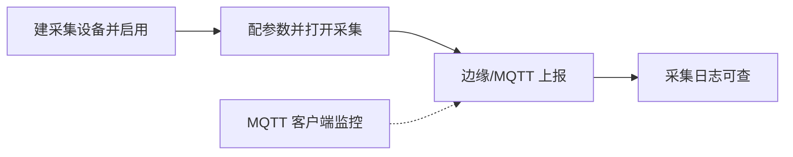

# 设备管理（数采）

> 适用基线：测试环境目标 / `dev` 分支 / 2026-07-15。
> 阅读对象：设备/自动化工程师、运维；操作见[设备管理-维护与查询参考](设备管理-维护与查询参考.md)。

## 业务目的与适用范围

本组覆盖数采侧的**设备主档、采集结果查询与 MQTT 链路监控**：

- **设备管理（采集数据资产）**：维护参与采集的设备编码、名称、类别与启用状态。
- **采集日志**：查询参数采集时序（设备、参数、采集点、值、客户端等）。
- **MQTT 客户端监控**：查看客户端在线状态与上下线时间。

名称中的「设备」指**数采资产**，与 DBC「设备台账」、EAM「维修对象」可能编码对齐，但页面与数据对象独立；**未证实**自动同步。

## 如何使用本组文档

| 你的目的 | 建议阅读 |
| --- | --- |
| 想理解设备—日志—MQTT 关系 | 本页 |
| 正在建档设备或查日志 | [设备管理-维护与查询参考](设备管理-维护与查询参考.md) |
| 想配采集点与参数项 | [采集点](../01-采集点/index.md) |
| 想看消费侧如何用读数 | [数采与边缘接入模型](../04-数采与边缘接入模型.md)、MES 点检相关页 |

## 使用前准备

| 需要确认什么 | 为什么重要 |
| --- | --- |
| 采集点与参数项已配且打开采集 | 否则日志长期为空 |
| 设备类别字典（`iot_asset_type`） | 建档分类 |
| MQTT/边缘客户端约定 | 监控与日志中的客户端 ID 才有意义 |
| 在线状态字典（`iot_client_link_staus`） | 筛选在线/离线 |

!!! example "📷 截图占位"
    采集设备列表（编码、类别、启用）与采集日志一行样例。

## 对象与主路径

| 对象 | 关键业务字段（已从前端取证） | 使用者关心 |
| --- | --- | --- |
| 采集设备 | 设备编码、名称、类别、状态（启用/不启用） | 是否启用、编码是否与现场一致 |
| 参数采集日志 | 设备编码、参数编码、采集点、采集值、采集时间、客户端 ID、参数类型等 | 有没有值、值对不对、哪个客户端上报 |
| MQTT 客户端状态 | 客户端 ID、在线状态、上线/下线时间、用户名等 | 链路是否断 |

## 状态与关键动作

| 对象 | 常见动作 | 说明 |
| --- | --- | --- |
| 采集设备 | 新增/编辑/删除/导出 | 状态开关：启用 `0` / 不启用 `1`（以页面开关为准） |
| 采集日志 | 查询、导出；表单能力以页面为准 | 日志以查询为主，勿当业务单据改库存 |
| MQTT 监控 | 查询、导出；新增入口可能隐藏 | 偏运维监控 |

## 关键判断

| 判断点 | 应先确认什么 | 影响 |
| --- | --- | --- |
| 设备启用仍无日志 | 参数采集开关、分区、边缘进程、MQTT 在线 | 分层排查 |
| 日志有值业务读不到 | MES/WMS 是否走网关 RPC、编码是否一致 | 消费侧问题 |
| MQTT 长期离线 | 客户端认证、网络、Broker | 上报中断 |
| 与 DBC 台账对不上 | 是否约定同一编码体系 | 跨模块联查失败 |

## 限制与待确认

- 采集日志是否时序库、保留多久、可否人工改历史：网关仓外，**待证实**；培训默认以查询/导出为主。
- MQTT 状态是网关写入还是人工维护：页面偏监控，**待联调确认**。
- 与 MES 点检读参、WMS 部分作业读参的失败码与重试：见消费模块与 `GAP-072`。
