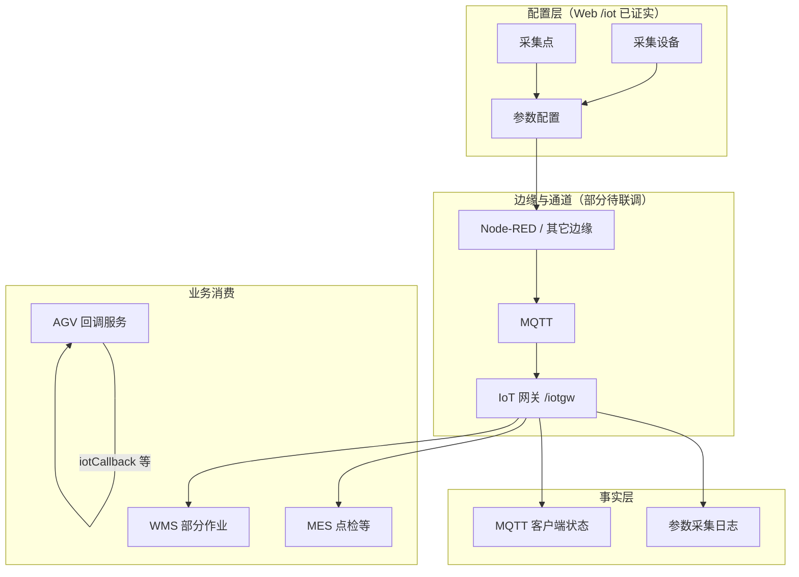

# 数采与边缘接入模型

> 适用基线：测试环境目标 / `dev` 分支 / 2026-07-15。
> 阅读对象：测试、实施、运维（主）；集成与自动化工程师（顺带）。

## 业务目的与适用范围

把采集原始值、设备台账和业务事件混在一页讲，最容易把排障方向带偏。本页用分层模型说明：配置（采哪里、采什么）、通道（边缘/MQTT）、时序事实（采集日志）与业务消费（MES 点检、WMS 读参、AGV 回调）各自负责什么。

读完本页，应能：指出「无数据」时该查配置层还是通道层；并知道本仓库已证实的是 Web 管理面，IoT 网关实现在仓外。旧版规划书中的 PLC/插件方向只作核验清单，不直接认定为现状。

## 如何使用本页

| 你的目的 | 建议阅读 |
| --- | --- |
| 分清配置 / 通道 / 事实 / 消费 | 本页分层模型 + 边界表 |
| 正在配采集点或查日志 | [采集点](01-采集点/index.md)、[设备管理](02-设备管理/index.md) |
| 评估 Node-RED | [NodeRed](03-NodeRed.md)（薄弱） |
| 联调接口路径 | [模块接口索引](../14-API参考/02-模块接口索引.md) 的「数采 / IoT」节 |

## 分层模型

| 层级 | 已证实 | 未证实 / 薄弱 |
| --- | --- | --- |
| 配置层 | 五类 Web 页 + `/iotgw` CRUD/导出路径族 | 网关 DDL、唯一约束、删除级联 |
| 边缘与通道 | 菜单与 MQTT 监控页存在；MES/WMS 依赖 `iotgw` API 包 | Node-RED 页面实现；补传/时钟/去重策略 |
| 事实层 | 采集日志、MQTT 状态页面字段 | 时序存储引擎与保留期 |
| 业务消费 | MES 点检服务引用网关读参/发消息；WMS 部分服务引用读参；AGV 提供 `iotCallback` | 各场景字段映射与失败补偿全量矩阵 |

!!! example "读完自检"
    **给定：** 点检读数为空，采集日志也无近期值。
    **期望判断：** 先查配置层（设备启用、是否采集、分区编码）与通道（MQTT 在线），再查 MES 消费；不要先改 DBC 台账或 EAM 工单。若日志有值而业务读不到，才转向网关 RPC / 编码一致性。

## 与邻近模块的权威边界

| 主题 | 权威落点 | 说明 |
| --- | --- | --- |
| 设备身份与工厂归属 | **DBC** 设备/工装台账、车间产线工位 | 数采「采集设备」是采集侧资产 |
| 维修 / 巡检工单 | **EAM** | 不读采集日志当工单 |
| 异常呼叫 | **ANDON** | 事件响应 ≠ 参数时序 |
| 库存事务 | **WMS** | 即使作业读了 IoT 值，库存仍以 WMS 为准 |
| AGV 点位地图 | **DBC** 点位 / 潜伏式 AGV 点位 | AGV 模块侧重任务回调，不作数采配置台 |
| 线边报工 | **MES 终端** | Node-RED 不得替代终端状态机文档 |

## 待确认事项

| 主题 | 需要确认的内容 |
| --- | --- |
| 采集对象 | 信号、协议、采样频率、工程单位与字典取值全集。 |
| 接入方式 | Node-RED、MQTT、PLC、HTTP 等在目标环境中的实际组合。 |
| 数据质量 | 离线缓存、断线补传、去重、时钟、异常值、保留周期。 |
| 业务消费 | 点检、叫料/容器、AGV 触发等与采集编码的映射及失败处理。 |
| 安全 | 集成账号权限、MQTT 认证、回调接口暴露面。 |

## 文档入口

| 需求 | 入口 |
| --- | --- |
| 配采集点与参数 | [采集点](01-采集点/index.md) |
| 查设备/日志/MQTT | [设备管理](02-设备管理/index.md) |
| Node-RED | [NodeRed](03-NodeRed.md) |
| 接口索引 | [模块接口索引](../14-API参考/02-模块接口索引.md) |
| 内部缺口 | 内部资料 |
