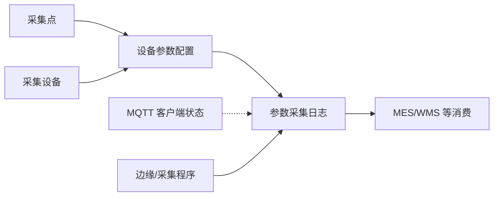

# 数采管理

> 适用基线：测试环境目标 / `dev` 分支 / 2026-07-15。
> 阅读对象：测试、实施、运维（主）；设备/自动化工程师（顺带）。

## 业务目的与适用范围

现场参数采不到、点检读数空、MQTT 显示离线——问题往往不在 MES/WMS 单据页，而在「采哪里 / 采什么 / 链路是否通」。数采管理维护采集点与参数配置、查询采集时序，并监控 MQTT 在线状态。

读完本页，应能：按「采集点 → 设备与参数 → 日志/MQTT」顺序排查；并分清本模块**不是** DBC 台账、EAM 工单、ANDON 呼叫或 WMS 搬运任务的替代页。

前端菜单根路径为 `/iot`；管理端接口前缀为 `/iotgw/...`（IoT 网关服务，本仓库无其完整后端源码）。MES/WMS 可通过网关 RPC 读参或发消息（如点检），属消费侧；AGV 另有独立回调入口。

## 如何使用本组文档

| 你的目的 | 建议阅读 |
| --- | --- |
| 想理解采集如何配起来 | 本页 + [数采与边缘接入模型](04-数采与边缘接入模型.md) |
| 正在维护采集点 / 参数项 | [采集点](01-采集点/index.md) |
| 正在查设备、日志、MQTT 在线 | [设备管理](02-设备管理/index.md) |
| 想找 Node-RED 相关入口 | [NodeRed](03-NodeRed.md)（资料薄弱，见该页） |
| 联调对外接口 | [API 模块索引](../14-API参考/02-模块接口索引.md) 的「数采 / IoT」节 |

## 业务分组

| 分组 | 说明 | 菜单入口（已证实） |
| --- | --- | --- |
| [01-采集点](01-采集点/index.md) | 采集点信息；设备参数配置（参数项与分区编码） | 采集点管理、设备参数配置 |
| [02-设备管理](02-设备管理/index.md) | 采集侧设备主档、参数采集日志、MQTT 客户端监控 | 设备管理、采集日志、MQTT客户端监控 |
| [03-NodeRed](03-NodeRed.md) | Node-RED 管理/日志导航意图 | NodeRed管理、NodeRed日志管理（页面实现薄弱） |
| [04-数采与边缘接入模型](04-数采与边缘接入模型.md) | 职责分层与跨模块边界 | — |

## 核心对象关系

| 对象 | 业务含义 |
| --- | --- |
| 采集点 | 编码/名称 + 目标 IP、端口、参数地址、目标类型及扩展参数。 |
| 采集设备 | 数采侧资产编码/名称/类别/启用状态；**不等于** DBC 设备台账。 |
| 设备参数配置 | 某设备下的参数编码、类型、读写方式、是否采集、分区编码（挂采集点规则）。 |
| 参数采集日志 | 时序采集值：设备、参数、采集点、值、时间、客户端等。 |
| MQTT 客户端状态 | 客户端在线/上下线时间等监控信息。 |

## 建议维护顺序

1. 建采集点（目标可达信息齐）。
2. 建采集设备并启用。
3. 为设备配置参数项，分区编码与采集点对齐，打开「是否采集」。
4. 边缘侧按约定上报后，用采集日志与 MQTT 监控验收。

!!! example "写实示例：给定配置 → 期望行为"
    **给定：** 采集点 `CP-LINE1`（目标 IP/端口已通）；采集设备 `DEV-01` 已启用；参数 `TEMP` 分区编码=`CP-LINE1`、是否采集=是；边缘客户端在线。
    **期望：** 采集日志可按设备/参数/采集点查到值；MQTT 监控可见对应客户端在线。若分区编码写错或「是否采集」=否，日志通常长期为空——先查配置，再查边缘。

## 与 DBC / MES / WMS / AGV / EAM 边界

| 协同方 | 本模块负责 | 不在本模块展开 |
| --- | --- | --- |
| DBC 设备/工装台账 | 编码可对齐引用（未证实强制同步） | 台账身份、归属车间产线 |
| MES | 点检等可通过网关读参/发消息 | 工单、报工、线边终端 |
| WMS | 部分作业可查询 IoT 数据 | 库存事务、PDA 任务 |
| AGV | 点位主数据在 DBC；任务回调在 AGV 服务 | 潜伏式点位配置、搬运任务 |
| EAM / ANDON | 故障与呼叫业务 | 采集原始时序本身 |

## 关键判断

| 判断点 | 应先确认什么 | 影响 |
| --- | --- | --- |
| 日志无数据 | 参数是否采集项=是、采集点/分区编码、边缘与 MQTT 是否在线 | 避免只改 Web 配置却无上报 |
| 读不到设备参 | 采集点目标 IP/端口/地址、设备是否启用 | 点检/业务读参失败 |
| 与台账编码不一致 | 数采 `assetCode` 与 DBC 设备编码是否约定一致 | 跨模块对不上号 |
| Node-RED 菜单打不开 | 见 [NodeRed](03-NodeRed.md) 薄弱说明 | 勿当成完整运维台 |

### 建议验证点

- 新建采集点 → 建设备并启用 → 配参数（分区对齐、打开采集）→ 日志可查到值。
- 故意把「是否采集」改为否或分区编码改错：日志应不再按预期出现该项。
- MQTT 监控与日志中的客户端 ID 能对照上（环境启用 MQTT 时）。
- 业务读参失败时：先核数采配置与在线状态，再查 MES/WMS 消费侧。

## 限制与待确认

- IoT 网关后端（`win-module-iotgw`）不在本仓库；字段以 Web 表单/API 与字典为准，DDL 待仓外取证（`GAP-072`）。
- 数采设备与 DBC 台账是否双向同步：**未证实**。
- Node-RED 管理页与日志页：菜单有、前端视图与现行后端对象薄弱（见该组）。
- 边缘协议细节、断线补传、保留策略：待现场与网关服务核验。
