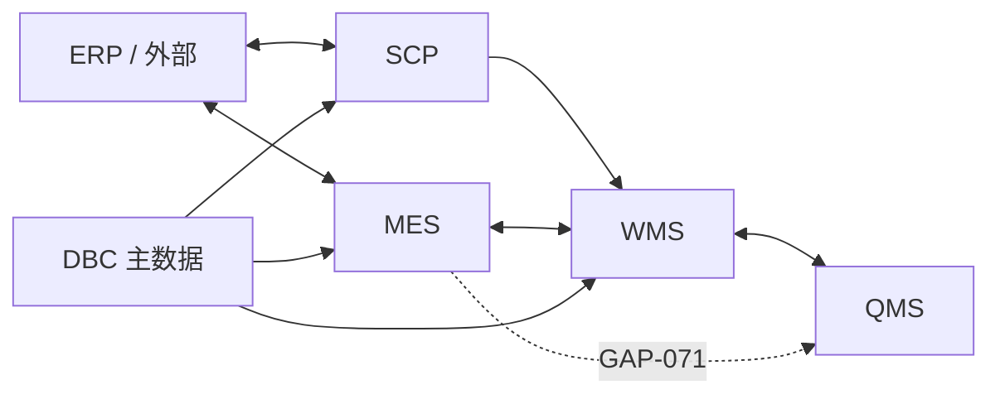

# 跨系统集成场景

> 适用基线：测试环境目标 / `dev` 分支 / 2026-07-15。  
> 说明集成**方向与权威边界**；报文映射未证实时不编造。平台重试见[数据交换](../03-基础设施/09-数据交换与集成可靠性.md)。

## 总览

## 场景矩阵（已证实 / 未证实）

| 场景 | 方向 | 权威落点 | 文档入口 | 状态 |
| --- | --- | --- | --- | --- |
| 供应商发货协同 / ASN | SCP → WMS | 库存与收货执行在 **WMS** | [发货协同](../10-SCP-供应链平台/05-发货协同/index.md) | 推送线索已证实；字段映射 P2 |
| SCP 主数据 | SCP `basic_*` ↔ DBC | 主数据长期归属待确认；**并存** | [SCP 基础数据](../10-SCP-供应链平台/01-基础数据/index.md) | 同步未证实 |
| 来料检验触发 | WMS 到货确认 → QMS | 检验结论在 **QMS**；放行/隔离库存在 **WMS** | [来料检验](../07-QMS-质量管理/02-来料检验/index.md) | 主触发已证实 |
| 采购收货建检 | （历史） | — | 同上 | **已停用**，勿再写成现状 |
| ERP 订单入 MES | ERP 订单 → 转换生产订单 → 工单 | 执行在 **MES** | [计划管理](../06-MES-生产管理/03-计划管理/index.md) | 转换动作已证实 |
| 工单下发与报工 | MES 内部 API | 过程事实在 MES | 计划 / 终端 | 已证实 |
| 完工 / 投料库存 | MES 协同 → WMS | **WMS** 事务与余额 | WMS 生产/发料页；`GAP-067` 等 | 边界已写；联调 P2 |
| 报工 NG → QMS | MES → QMS | — | `GAP-071` | **未证实** |
| 备件出入库 | EAM ↔ WMS 非计划 | 库存 **WMS** | [EAM 备件](../08-EAM-设备管理/index.md) | 同步线索已写；盘点回写待确认 |
| 排程结果发布 | PS → MES/ERP | — | [PS](../11-PS-排程管理/index.md) | **无实现** |
| 接口失败恢复 | 任意 → 平台记录 | 调用信息 + 异步重试 | [数据交换](../03-基础设施/09-数据交换与集成可靠性.md) | 平台能力已证实 |

> 发货协同等分组从 [SCP 概述](../10-SCP-供应链平台/index.md) 进入即可。

## 集成设计检查清单

- [ ] 明确哪边是库存/质量/计划的**权威**。  
- [ ] 外部单号与内部单号可双向联查。  
- [ ] 失败可在接口调用信息中定位，并有重试/补偿说明。  
- [ ] 权限：集成账号最小权限，不使用超管。  
- [ ] 幂等：重复推送不产生双库存/双检验。  

## 与业务挂接模型页的关系

更宏观的「待填任务」仍见[第三方接口与单据挂接](../02-业务模型/03-第三方接口与单据挂接.md)。本页记录 **BATCH-04 时点已从模块文档收敛的结论**；冲突时以更新的模块证据为准并回写本表。
