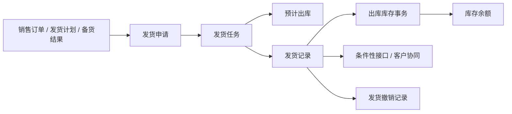

# WMS 销售出库事实层总览

> 内部工作底稿，不对产品站点发布。
> 范围：发货计划、标准发货申请/任务/记录、发货撤销、备货、客户退货、销售结算出库及相关 PDA 入口。
> 基线：测试环境 / `dev` 分支 / 2026-07-15。

## 1. 用途与使用边界

本页是销售出库相关对象的内部证据入口。它只记录范围、对象关系、证据状态和待验证问题；字段与服务细节见[销售出库](销售出库.md)。

正式 `docs/` 页面只转写已确认的业务结论，不直接链接本目录。第一阶段正文以**标准发货主链**为可讲可查范围；其它子域只写边界。

## 2. 本轮页面范围

| 分组 | 菜单/业务对象 | 当前文档形态 | 本轮目标 |
| --- | --- | --- | --- |
| 标准发货 | 申请、任务、记录、撤销记录。 | 主文档 + 维护与查询参考 + 事实页。 | 固化申请处理→预计出→执行→记录→事务→余额主链。 |
| 发货计划 | 计划主明细。 | 在主文档/参考页作为来源说明。 | 不单独扩成完整业务页，除非后续判定需要。 |
| 备货 | 申请、任务、记录。 | 边界说明。 | 专项取证前不并入主流程结论。 |
| 客户退货 | 申请、任务、记录、撤销。 | 边界说明。 | 专项取证前不与发货混写。 |
| 销售结算出库 | 申请、记录、撤销。 | 边界说明。 | 不写成标准发货必经后续。 |
| 库存挂接 | 预计出、库存事务、库存余额。 | 复用库存管理已有正式页与证据。 | 只补充发货特有时点。 |
| 终端 | PDA 发货任务/直接发货、备货、退货。 | 维护参考中的终端章节。 | 补截图与状态前置条件。 |

## 3. 标准发货对象关系

## 4. 事实层建设顺序

| 顺序 | 先沉淀什么 | 主要证据 | 后续可复用到 |
| --- | --- | --- | --- |
| 1 | 菜单与页面清单、对象边界。 | `reference/menu.csv`、前端路由。 | 导航、页面清单、终端入口说明。 |
| 2 | 申请—任务—记录创建、处理、执行与撤销。 | `Deliver*MainService`、动作接口。 | 业务主文档、培训流程。 |
| 3 | 预计出、事务、余额时点。 | 任务执行与记录服务、库存对象证据。 | 库存联查与异常排查。 |
| 4 | 导入、PDA、RBAC、子域闭环。 | 前端、导入 VO、终端页面、测试环境。 | 维护参考补强与问题关闭。 |

## 5. 已知问题与待确认事项

| 编号 | 问题 | 影响范围 | 后续处理 |
| --- | --- | --- | --- |
| GAP-068 | 多链路、终端与外部接口完成态待验证。 | 培训完成态、子域状态机。 | 主链已取证；子域与接口可靠性继续验证。 |
| GAP-047 | 客户月台唯一性与导入边界不闭合。 | 发货申请引用交付地点。 | 主数据侧跟踪；发货页只提醒引用风险。 |
| WMS-SO-001 | 备货转入发货的状态与数量闭环未专项取证。 | 备货/发货联训。 | 建立备货事实页或扩写本页子节。 |
| WMS-SO-002 | 销售结算出库与标准发货的业务分工未产品确认。 | 页面学习顺序。 | 保持边界说明，待产品确认后决定是否独立成页。 |

## 6. 事实页清单

| 事实页 | 状态 | 对应正式文档 |
| --- | --- | --- |
| [销售出库](销售出库.md) | 已建。 | 销售出库主文档与维护参考。 |
| 备货 | 待建。 | 暂在销售出库页作边界说明。 |
| 客户退货 | 待建。 | 暂在销售出库页作边界说明。 |
| 销售结算出库 | 待建。 | 暂在销售出库页作边界说明。 |
