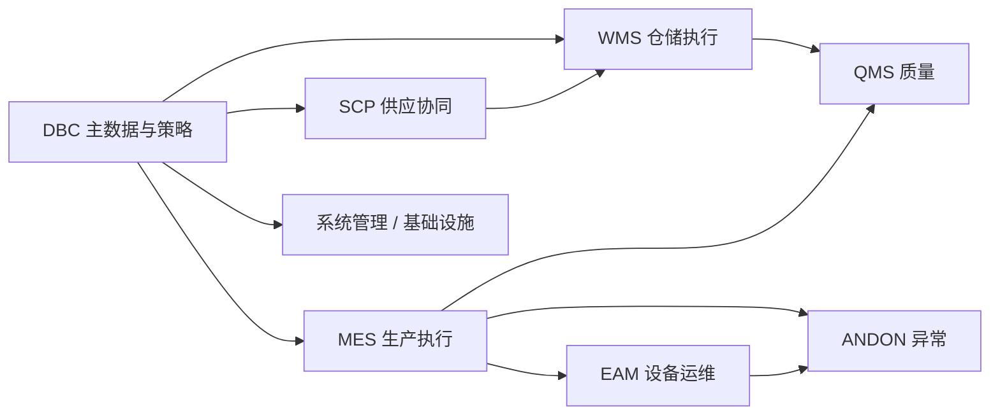

# 系统边界与产品全景

> 状态：产品级边界与模块全景可扫读；「当前环境启用哪些模块 / 外部系统」等仍待按菜单与集成配置核验，文末列出待确认项，**不写成已上线承诺**。
> 阅读对象：售前浅层（主）；测试 / 实施在进业务模块前建立产品级边界印象。

本页回答三件事：MOM **覆盖哪些制造运营业务**、**模块大致怎么切**、**与外部系统的边界在哪**。读完可对外讲清范围；细流程与配置请转业务主文档，不要在本页找字段表。

## 产品全景（扫读）

| 模块 | 在全景中的位置（一句话） | 文档入口 |
| --- | --- | --- |
| DBC | 统一「是什么」：物料、仓位、业务对象与策略配置 | [DBC](../04-DBC-主数据管理/index.md) |
| SCP | 采购订单、预测/计划、发货协同、跟踪与结算 | [SCP](../10-SCP-供应链平台/index.md) |
| WMS | 收货、上架、发料、库存、盘点与仓储终端 | [WMS](../05-WMS-库房管理/index.md) |
| MES | 工艺/计划执行、报工、追溯与线边终端 | [MES](../06-MES-生产管理/index.md) |
| QMS | 检验、质量判定与评审 | [QMS](../07-QMS-质量管理/index.md) |
| EAM | 维修保养等运维执行（设备**身份台账**多在 DBC） | [EAM](../08-EAM-设备管理/index.md) |
| ANDON | 异常呼叫与响应到岗 | [ANDON](../09-ANDON-异常管理/index.md) |
| PS | **规划中**：本仓无可用实现，不可按已上线能力对外承诺 | [PS](../11-PS-排程管理/index.md) |
| 数采 | 采集配置、日志与边缘上报通道 | [数采](../13-数采管理/index.md) |
| 系统 / 基础设施 | 租户权限、报表、消息、部署与公共能力 | [系统管理](../12-系统管理/01-租户与认证/index.md)、[基础设施](../03-基础设施/index.md) |

职责与「谁说了算」的对照表见[模块边界与系统上下文](04-模块边界与系统上下文.md)。售前浅层下一步：扫模块边界表，再打开 2～3 个模块首页的「解决什么问题」即可停。

## 外部边界（诚实表述）

本产品定位为制造运营协同与执行中枢；下列对象通常作为**外部或旁路**，是否对接、对接深度以项目集成为准，**未核验前不作统一承诺**：

| 外部 / 旁路 | 典型关系 | 说明口径 |
| --- | --- | --- |
| ERP | 主数据或单据可能双向同步 | 接口字段与失败处理见业务模型与 API 页，不在本页展开 |
| WCS / AGV / PLC | 仓储自动化、设备控制 | 控制内核一般不在 MOM；回调与任务边界待集成核验 |
| 供应商 / 客户平台 | 经 SCP 等协同 | 以已开通门户与接口为准 |
| Finance 等旁路模块 | 源码/菜单可能有线索 | 站点未单开为完整业务批次时，不按标准模块对外介绍 |

## 参考设计：能力分层（待核验）

旧版规划书的分层仅作梳理范围的参考，**不代表**当前环境已全部启用：

| 层次 | 参考范围 | 当前核验要求 |
| --- | --- | --- |
| 核心业务 | 采购收货、质量、生产、发运结算、库存、库内作业、包装/器具、盘点 | 按模块菜单、服务确认是否存在及实际边界 |
| 支撑业务 | 主数据、标签、策略、报表与看板 | 确认配置入口、运行能力与使用模块 |
| 公共业务 | 账号权限、系统设置、消息、日志与监控 | 以系统管理、基础设施相关页面与实现为准 |

## 浅层读者停在这里

| 目的 | 下一步 | 不要做 |
| --- | --- | --- |
| 售前介绍 | [模块边界](04-模块边界与系统上下文.md) → 模块首页「解决什么问题」 | 链进维护与查询参考、字段长表 |
| 测试 / 实施 | 选定模块后进**主文档**深读 | 把本页「参考设计」当成已验收功能清单 |

确认后的产品级边界会保留在本页；具体接口字段、业务流与失败处理分别链接到[第三方接口与单据挂接](../02-业务模型/03-第三方接口与单据挂接.md)和平台集成相关页。

## 待确认事项

| 编号 | 待确认内容 | 主要证据 |
| --- | --- | --- |
| ARCH-CTX-01 | 当前启用模块、租户/工厂范围和用户角色 | 菜单、测试环境、项目配置 |
| ARCH-CTX-02 | ERP、WCS、AGV、PLC、供应商/客户平台等外部边界 | 网关、接口配置、部署配置、测试报文 |
| ARCH-CTX-03 | 每个模块的系统-of-record（事实数据归属） | 与[模块边界](04-模块边界与系统上下文.md)权威落点对照核验 |
