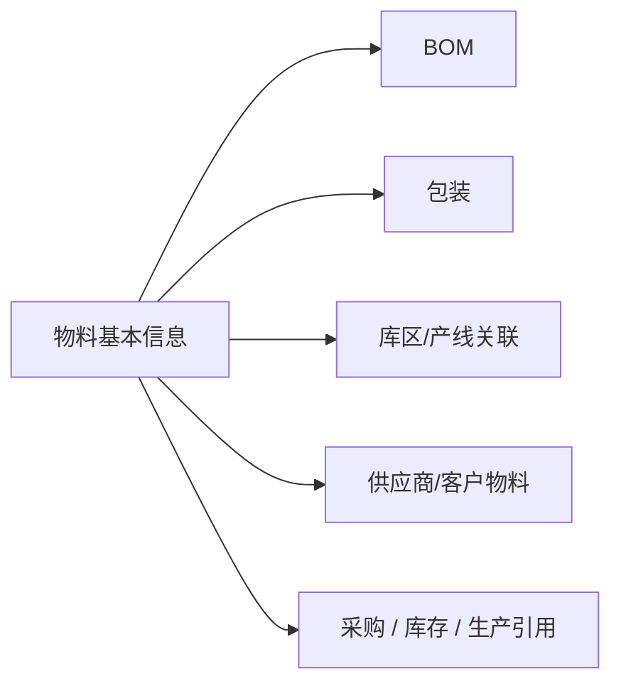

# 物料管理

> 适用基线：测试环境 / `dev` 分支 / 2026-07-15。
> 阅读对象：测试、实施（主）；主数据维护、采购/仓储/生产协同（顺带）。

## 这一组解决什么问题 / 功能范围

物料管理定义企业实际采购、存放、制造、交付或核算的对象及其关联条件，让各岗位以同一物料口径处理业务，避免「同物不同码」或「同码不同含义」。

**范围外：** 库存数量、出入库事务与现场收发执行归 [WMS](../../05-WMS-库房管理/index.md)；供应商/客户侧编码匹配见对应伙伴分组。

## 如何使用本组文档（测试 / 实施）

| 你的目的 | 建议阅读 |
| --- | --- |
| 设计物料可选性、单位/包装/停用类验证 | **各叶页主文档**（逻辑、影响、配置约束） |
| 新增/导入/字段与选择器细节 | 同对象的**维护与查询参考**（如有） |
| 从收货/库存问题回查物料口径 | WMS 业务页 → [物料基本信息](01-物料基本信息.md) 及关联页 |

售前介绍请停在 [DBC 模块首页](../index.md)，不必进入本组维护参考。

## 本组学习顺序

| 顺序 | 页面 | 先解决什么 | 与下一步怎样衔接 |
| --- | --- | --- | --- |
| 1 | [物料基本信息](01-物料基本信息.md) | 统一识别、用途、单位与状态 | 包装、BOM、库区/产线关联的前提（W1 定标） |
| 2 | [BOM](02-BOM.md) | 成品/半成品构成 | 生产与成本理解 |
| 3 | [物料包装信息](03-物料包装信息.md)、[包装规格](04-包装规格.md) | 包装层级与数量处理 | 收货、库存、扫码 |
| 4 | [物料库区配置](05-物料库区配置管理.md)、[生产线物料关系](06-生产线物料关系管理.md) | 默认存放与产线使用关系 | 仓储/生产现场判断 |
| 5 | [标准成本价格单](07-标准成本价格单管理.md) | 物料成本参考口径 | 下游取价范围以叶页为准 |

## 配置依赖概览

| 依赖 | 影响 | 在哪确认 |
| --- | --- | --- |
| 组织归属、字典、单位 | 可选值与编码口径 | 系统管理 / 字典 |
| 仓库（及后续库区配置） | 默认存放能否挂接 | [工厂建模](../04-工厂建模/index.md) |
| 产线 | 生产线物料关系能否挂接 | [工厂建模](../04-工厂建模/index.md) |
| 业务类型等策略（若叶页引用） | 部分业务可选范围 | [策略设置](../05-策略设置/index.md) |

本组以主数据维护为主；多数页无独立「单据设置」，受上游字典与引用保护约束。

## 关键业务对象与关系

## 本组页面一览

| 页面 | 文档形态 | 说明 |
| --- | --- | --- |
| [物料基本信息](01-物料基本信息.md) | 主文档 + [维护参考](02-物料基本信息-维护与查询参考.md) | W1 定标；维护主线与导入查询 |
| [BOM](02-BOM.md) | 主文档 + [维护参考](08-BOM-维护与查询参考.md) | 产品结构与变更影响 |
| [物料包装信息](03-物料包装信息.md)、[包装规格](04-包装规格.md) | 主文档 | 包装使用场景 |
| [物料库区配置](05-物料库区配置管理.md) | 主文档 + [维护参考](09-物料库区配置管理-维护与查询参考.md) | 当前多为物料—仓库默认配置 |
| [生产线物料关系](06-生产线物料关系管理.md) | 主文档 + [维护参考](10-生产线物料关系管理-维护与查询参考.md) | 产线—物料关系 |
| [标准成本价格单](07-标准成本价格单管理.md) | 主文档 + [维护参考](11-标准成本价格单管理-维护与查询参考.md) | 按物料的标准价格口径 |

## 常见问题与相关分组

业务页选不到物料、单位不一致或包装/库位不匹配时，先回查本组；数量问题转 WMS。供应/客户口径见[供应商管理](../02-供应商管理/index.md)、[客户管理](../03-客户管理/index.md)。
