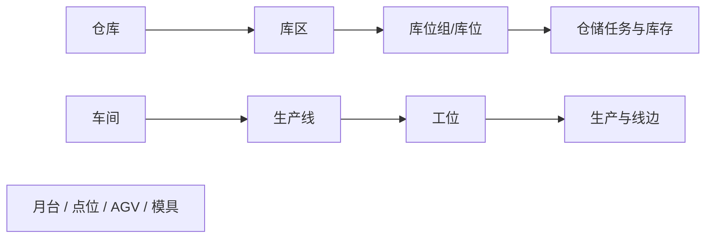

# 工厂建模

> 适用基线：测试环境 / `dev` 分支 / 2026-07-15。
> 阅读对象：测试、实施（主）；仓储/生产现场建模人员（顺带）。

## 这一组解决什么问题 / 功能范围

工厂建模描述「物料在哪里存放、生产在哪里发生、设备或自动化点位在哪里工作」，把仓储与生产空间转化为可被 WMS、MES 及终端引用的业务地点。

**范围外：** 收发任务与库存余额归 WMS；生产报工归 MES；设备运维执行归 EAM。模具/点位与 EAM、自动化的最终归属以叶页边界为准。

## 如何使用本组文档（测试 / 实施）

| 你的目的 | 建议阅读 |
| --- | --- |
| 验证仓→区→位级联、启停与可选地点 | 仓储空间叶页**主文档** + [库位与仓储级联惯例](../../02-业务模型/13-库位与仓储级联惯例.md) |
| 维护/导入/字段细节 | 同对象**维护与查询参考** |
| 生产地点与工艺衔接 | 车间/产线/工位 → [工艺建模](../08-工艺建模/index.md) |

售前介绍请停在 [DBC 模块首页](../index.md)。

## 本组学习顺序

| 顺序 | 页面 | 先解决什么 | 与下一步怎样衔接 |
| --- | --- | --- | --- |
| 1 | [仓库](01-仓库管理.md) → [库区](02-库区管理.md) → [库位组](04-库位组管理.md) / [库位](03-库位管理.md) | 仓储空间层级 | 收货、上架、库存、盘点 |
| 2 | [月台](05-月台管理.md) | 收发货交接地点 | 到货、发运协同 |
| 3 | [车间](06-车间管理.md) → [生产线](07-生产线管理.md) → [工位](08-工位管理.md) | 生产现场组织 | 工艺、生产执行、线边物流 |
| 4 | [模具信息](11-模具信息管理.md)、[点位](12-点位管理.md)、[AGV 点位配置](13-潜伏式AGV点位配置表.md) | 设备/自动化现场资料 | 与 EAM/终端边界按叶页确认 |

## 配置依赖概览

| 依赖 | 影响 | 在哪确认 |
| --- | --- | --- |
| 组织归属、启停状态 | 地点是否可选 | 本页各对象 |
| 仓→区→位级联 | 下游选择器范围 | [库位与仓储级联惯例](../../02-业务模型/13-库位与仓储级联惯例.md) |
| 车间→产线→工位 | MES/工艺挂接对象 | 本页 + MES/工艺叶页 |
| WMS/MES 是否引用该地点 | 停用/删除保护与现场能否作业 | 对应执行模块 |

## 关键业务对象与关系

## 本组页面一览

| 页面 | 文档形态 | 说明 |
| --- | --- | --- |
| 仓库 / 库区 / 库位 / 库位组 / 月台 | 主文档 + 对应维护参考 | 仓储空间；已补级联语义 |
| 车间 / 生产线 / 工位 | 主文档 + 对应维护参考 | 生产空间 |
| 模具信息 / 点位 / AGV 点位 | 主文档（+ 部分维护参考） | 注意与 EAM/自动化边界 |

## 常见问题与相关分组

任务/库存选不到地点 → 查仓区位层级与状态；生产现场不匹配 → 查车间产线工位。设备运维勿在本组推断，见[设备管理](../07-设备管理/index.md)与 EAM。
