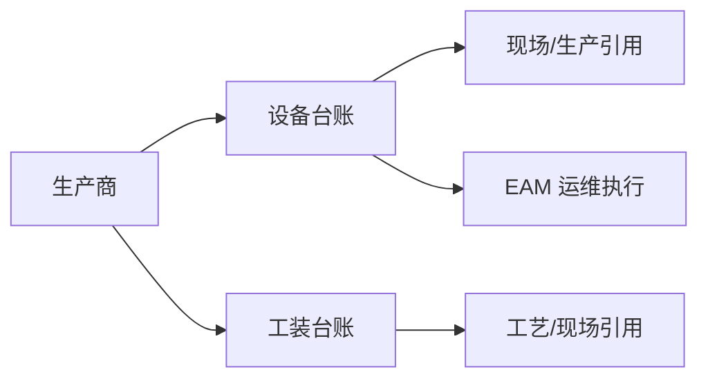

# 设备管理

> 适用基线：测试环境 / `dev` 分支 / 2026-07-15。
> 阅读对象：测试、实施（主）；设备台账维护人员（顺带）。

## 这一组解决什么问题 / 功能范围

DBC 设备管理（侧栏「设备台账（DBC）」）维护设备、工装与生产商等**可被引用的身份台账**：是什么资产/工装、由谁生产、在哪些业务中识别。

**范围外：** 报修、巡检保养、备件执行与 PDA 运维主链归 [EAM](../../08-EAM-设备管理/index.md)。工艺路线中的模具类型见[工艺建模](../08-工艺建模/index.md)。

## 如何使用本组文档（测试 / 实施）

| 你的目的 | 建议阅读 |
| --- | --- |
| 验证台账可引用性、停用与 EAM 边界 | 各叶页**主文档** |
| 新增/导入/字段细节 | 同对象**维护与查询参考** |
| 做保养/故障/备件场景 | **转到 EAM**，不要在本组推断工单规则 |

售前介绍请停在 [DBC 模块首页](../index.md)。

## 本组学习顺序

| 顺序 | 页面 | 先解决什么 | 与下一步怎样衔接 |
| --- | --- | --- | --- |
| 1 | [生产商管理](03-生产商管理.md) | 设备/工装制造方 | 台账引用 |
| 2 | [设备台账管理](02-设备台账管理.md) | 设备身份与现场归属 | 与 EAM 执行边界 |
| 3 | [工装台账管理](01-工装台账管理.md) | 工装/模具相关身份 | 可与工艺、生产、EAM 关联 |

## 配置依赖概览

| 依赖 | 影响 | 在哪确认 |
| --- | --- | --- |
| 生产商 | 台账制造方挂接 | 本页生产商 |
| 工厂/现场地点（若叶页引用） | 设备/工装归属地点 | [工厂建模](../04-工厂建模/index.md) |
| EAM 是否同步/引用 | 身份变更对运维侧的影响 | EAM 对应页 + 叶页边界说明 |

## 本组页面一览

| 页面 | 文档形态 | 说明 |
| --- | --- | --- |
| [工装台账管理](01-工装台账管理.md) | 主文档 + [维护参考](04-工装台账管理-维护与查询参考.md) | 工装身份与 EAM 边界 |
| [设备台账管理](02-设备台账管理.md) | 主文档 + [维护参考](05-设备台账管理-维护与查询参考.md) | 设备身份与 EAM 边界 |
| [生产商管理](03-生产商管理.md) | 主文档 | 制造方 |

## 常见问题与相关分组

要做保养/故障/备件 → EAM；要配工艺模具分类 → [工艺建模](../08-工艺建模/index.md)。
