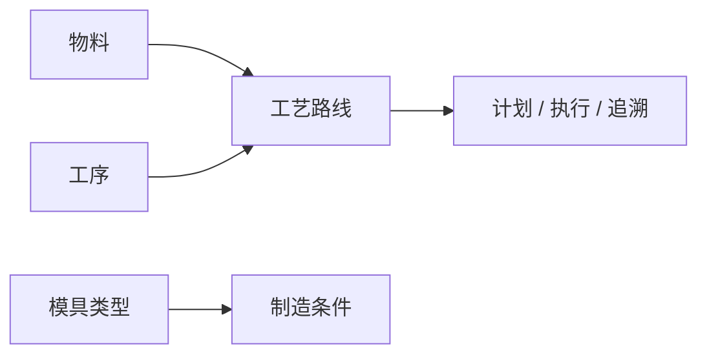

# 工艺建模

> 适用基线：测试环境 / `dev` 分支 / 2026-07-15。
> 阅读对象：测试、实施（主）；工艺/生产计划相关人员（顺带）。

## 这一组解决什么问题 / 功能范围

工艺建模描述物料如何经过工序、按什么路线在现场制造，并维护与工艺相关的模具分类，为计划、执行、追溯与工装使用提供过程口径。

**范围外：** MES 工艺运行、报工与终端执行归 [MES](../../06-MES-生产管理/index.md)；工序/路线在 DBC 与 MES 的维护主体以叶页边界为准；设备运维归 EAM。

## 如何使用本组文档（测试 / 实施）

| 你的目的 | 建议阅读 |
| --- | --- |
| 验证工序/路线版本与生产引用 | 各叶页**主文档** |
| 维护/导入/字段细节 | 同对象**维护与查询参考**（如有） |
| 看运行层如何消费工艺 | [MES 工艺管理](../../06-MES-生产管理/02-工艺管理/index.md) / 计划与终端 |

售前介绍请停在 [DBC 模块首页](../index.md)。

## 本组学习顺序

| 顺序 | 页面 | 先解决什么 | 与下一步怎样衔接 |
| --- | --- | --- | --- |
| 1 | [工序管理](01-工序管理.md) | 基本作业步骤 | 工艺路线组成基础 |
| 2 | [工艺路线](02-工艺路线.md) | 按物料与顺序组织制造路径 | 计划、执行、追溯 |
| 3 | [模具类型管理](03-模具类型管理.md) | 制造/工装相关分类 | 工装或工艺资料引用 |

## 配置依赖概览

| 依赖 | 影响 | 在哪确认 |
| --- | --- | --- |
| 物料 | 路线适用对象 | [物料管理](../01-物料管理/index.md) |
| 车间/产线/工位 | 现场步骤挂接 | [工厂建模](../04-工厂建模/index.md) |
| MES 工艺/工单配置 | 路线如何被下发与报工消费 | [MES](../../06-MES-生产管理/index.md) |

## 本组页面一览

| 页面 | 文档形态 | 说明 |
| --- | --- | --- |
| [工序管理](01-工序管理.md) | 主文档 | 工序步骤与引用边界 |
| [工艺路线](02-工艺路线.md) | 主文档 + [维护参考](04-工艺路线-维护与查询参考.md) | 路线/版本/节点；注意 MES 边界 |
| [模具类型管理](03-模具类型管理.md) | 主文档 | 分类口径；入口归属以叶页为准 |

## 常见问题与相关分组

生产拿不到正确工艺步骤 → 先查物料、工序、路线与现场地点；任务与追溯结果在 MES 查。
