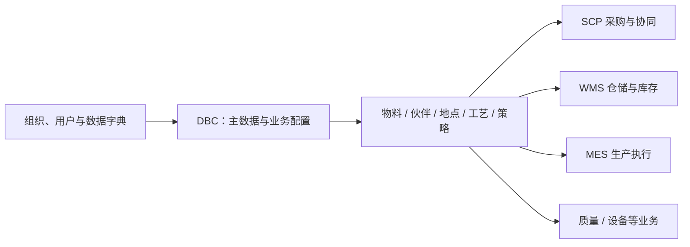

# DBC 主数据管理

> 适用基线：测试环境 / `dev` 分支 / 2026-07-15。
> 阅读对象：测试、实施（主）；主数据维护、采购/仓储/生产协同人员（顺带）。

## 模块解决什么问题

DBC（Data Base Core，主数据管理）维护各业务共同使用的基础资料与业务配置，让「物料是什么、由谁供应或使用、放在哪里、在哪个车间生产、采用什么工艺、单据按什么规则运行」有统一口径。

采购、仓储、生产、质量、设备等业务都引用 DBC。主数据不完整或口径不一致时，常见结果是单据选不到对象、单位无法统一、库存无法定位，或同一业务在不同人员眼中含义不同。

**不在本模块：** 收货、发料、盘点、检验、生产报工等现场作业结果由 WMS/MES/QMS/EAM 等执行模块负责。标签/条码/打印可在业务页触发，模板与审计长期归[平台能力](../03-基础设施/01-标签、条码与打印.md)。**与 EAM：** [设备台账（DBC）](07-设备管理/index.md)只维护身份与可引用主数据；报修/巡检/备件执行见[EAM](../08-EAM-设备管理/index.md)。

售前/对外介绍读到本节与下方「功能范围」即可停下，**不必**进入各组维护参考与字段长表。

## 功能范围

| 分组 | 覆盖什么 | 不覆盖什么 |
| --- | --- | --- |
| [物料管理](01-物料管理/index.md) | 物料、BOM、包装、默认库区/产线关联、标准成本 | 库存数量与出入库事务（WMS） |
| [供应商管理](02-供应商管理/index.md) | 供应商、供应商物料匹配 | 采购订单执行与收货结果（SCP/WMS） |
| [客户管理](03-客户管理/index.md) | 客户、客户月台、客户物料 | 销售出库/发运执行（WMS/SCP） |
| [工厂建模](04-工厂建模/index.md) | 仓/区/位、月台、车间/产线/工位、点位等地点 | 现场任务与库存余额（WMS/MES） |
| [策略设置](05-策略设置/index.md) | 班次/班组、业务类型、单据设置/开关、规则 | 各业务单据本身的执行过程 |
| [物流配置](06-物流配置/index.md) | 货主、承运商 | 承运过程跟踪与运费结算细则 |
| [设备管理](07-设备管理/index.md) | 设备/工装/生产商台账（身份） | EAM 运维执行 |
| [工艺建模](08-工艺建模/index.md) | 工序、工艺路线、模具类型 | MES 工艺运行与报工 |

## 测试 / 实施从哪读

| 你的目的 | 建议路径 |
| --- | --- |
| 初始化一套可开业务的最小主数据 | 本页维护顺序 → [工厂建模](04-工厂建模/index.md) → [物料管理](01-物料管理/index.md) → 伙伴（供应商/客户/物流）→ [策略设置](05-策略设置/index.md) |
| 设计「选不到物料/库位/供应商」类验证 | 对应分组主文档（状态、归属、关联）→ 同页或同对象**维护参考** |
| 讲清「改业务类型/单据设置 → 单据行为变化」 | [策略设置](05-策略设置/index.md) → [业务类型](05-策略设置/03-业务类型.md)、[单据设置](05-策略设置/04-单据设置.md)（W1 定标样板） |
| 从仓储/生产问题回查主数据口径 | [WMS](../05-WMS-库房管理/index.md) / [MES](../06-MES-生产管理/index.md) 业务页 → 跳回本模块对应分组 |

**建议学习顺序（降返工）：** 组织权限与字典 → 工厂建模 + 物流伙伴 → 物料/包装关联 → 工艺与生产关联 → 策略/单据/规则 → 持续治理（停用/替代）。

当前典型维护入口可先看[物料基本信息](01-物料管理/01-物料基本信息.md)（W1 定标）。

## 配置依赖概览

| 配置 / 主数据 | 影响什么 | 在哪确认 |
| --- | --- | --- |
| 组织、用户权限、数据字典 | 谁能维护、下拉口径、资料归属 | 系统管理 / 字典 |
| 仓库—库区—库位（及车间—产线—工位） | 收发、库存、生产可选地点 | [工厂建模](04-工厂建模/index.md) |
| 物料、包装、BOM、库区/产线关联 | 采购/库存/生产能否识别对象与单位 | [物料管理](01-物料管理/index.md) |
| 供应商/客户及其物料匹配 | 采购收货、交付匹配与追溯 | [供应商管理](02-供应商管理/index.md)、[客户管理](03-客户管理/index.md) |
| 业务类型、单据设置、单据开关、规则 | 单据分类、编号、可用入口与处理方式 | [策略设置](05-策略设置/index.md) |
| 货主、承运商 | 货权归属与运输协同对象 | [物流配置](06-物流配置/index.md) |

通例见[主数据治理模型](../02-业务模型/07-主数据治理模型.md)、[单据类型、业务类型与单据配置](../02-业务模型/05-单据类型、业务类型与单据配置.md)。

## 典型业务全景

## 跨模块边界

| 协作模块 | DBC 提供什么 | 该模块产生什么 | 追溯怎么走 |
| --- | --- | --- | --- |
| WMS | 物料、包装、仓/位、货主、业务类型等 | 收发、盘点任务/记录与库存结果 | 选错对象回 DBC；数量结果回 WMS |
| MES | 物料、工序/路线、车间/产线/工位等 | 计划、报工与追溯结果 | 工艺/地点口径回 DBC；生产结果回 MES |
| SCP | 物料、供应商、客户及匹配 | 订单、协同、交付相关结果 | 伙伴/物料匹配回 DBC |
| QMS / EAM | 物料、地点、设备/工装身份 | 检验、运维执行结果 | 主数据回 DBC；执行回所属模块 |

## 使用本模块前需要准备什么

| 需要准备什么 | 为什么需要 |
| --- | --- |
| 组织、权限与基础字典 | 决定维护人、归属与可选值口径 |
| 企业编码与命名规则 | 避免物料/伙伴/地点重复或难辨识 |
| 当前业务场景最小集合 | 先建能跑通场景的资料，再逐步补齐 |
| 变更与停用原则 | 避免直接改码/删除已被引用的关键资料 |

## 术语与相关文档

| 主题 | 建议阅读 |
| --- | --- |
| 主数据治理 | [主数据治理模型](../02-业务模型/07-主数据治理模型.md) |
| 业务类型 / 单据配置 | [单据类型、业务类型与单据配置](../02-业务模型/05-单据类型、业务类型与单据配置.md) |
| 申请 / 任务 / 记录 | [申请、任务与记录模型](../02-业务模型/01-申请任务记录模型.md) |
| 库存挂接 | [库存数据挂接模型](../02-业务模型/02-库存数据挂接模型.md) |
| 下游仓储 | [WMS 库房管理](../05-WMS-库房管理/index.md) |
