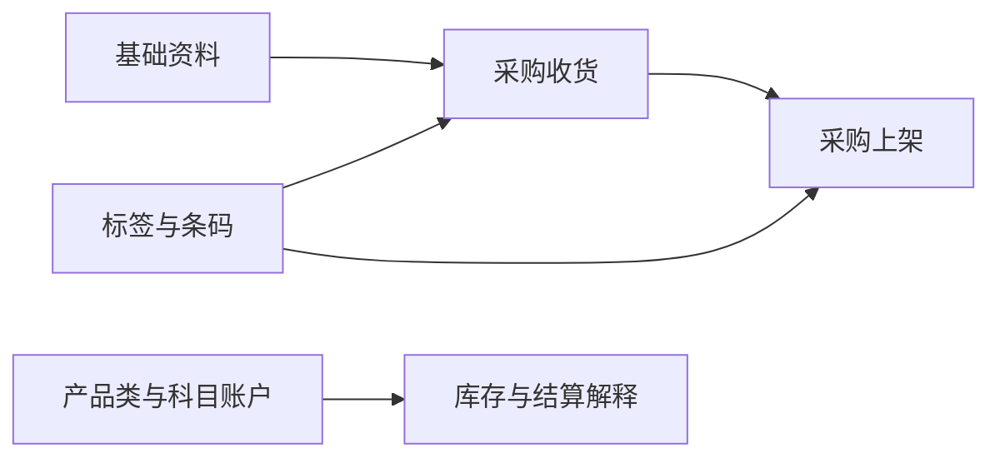

# WMS 基础数据

> 适用基线：测试环境 / `dev` 分支 / 2026-07-15。
> 阅读对象：测试、实施（主）；仓储结算/标签相关配置人员（顺带）。

## 这一组解决什么问题 / 功能范围

WMS 基础数据把「按什么价格、结算口径和标签规则解释仓储结果」落实为受控资料。它们不直接完成收货或上架，但会影响业务解释、打印识别、结算衔接与追溯。

**范围外：** 物料/仓位等主数据归 [DBC](../../04-DBC-主数据管理/index.md)；标签模板与打印审计长期归[平台能力](../../03-基础设施/01-标签、条码与打印.md)。

## 如何使用本组文档（测试 / 实施）

| 你的目的 | 建议阅读 |
| --- | --- |
| 判断某资料是否影响入库/结算/扫码 | **本页**范围与依赖 → 对应叶页主文档 |
| 维护价格单/科目/标签细则 | 同对象**维护与查询参考**（如有） |
| 跑入库链验证 | 先确认标签等前置 → [采购收货](../03-采购收货/index.md) |

售前介绍请停在 [WMS 模块首页](../index.md)。

## 本组学习顺序

| 顺序 | 资料 | 使用时机 | 维护原则 |
| --- | --- | --- | --- |
| 1 | [销售价格单](01-销售价格单.md) | 需按客户与物料识别价格 | 先明确适用客户、物料与生效期 |
| 2 | [产品类](02-产品类.md)、[科目账户配置](03-科目账户配置.md) | 差异/盘点/报废等结算归属 | 与财务口径一起确认，勿现场临时补录 |
| 3 | [ERP 成本中心](04-ERP成本中心.md)、[ERP 项目信息](05-ERP项目信息.md) | 科目归集前 | 对齐外部主数据/同步策略 |
| 4 | [标签与条码](06-标签与条码.md) | 收货、上架、库位标识与扫码前 | 先规则/类型/模板验证，再批量生成打印 |

## 配置依赖概览

| 依赖 | 影响 | 在哪确认 |
| --- | --- | --- |
| DBC 物料、客户等 | 价格单与标签对象能否挂接 | DBC |
| ERP 同步策略（成本中心/项目） | 本地改动是否被覆盖 | 叶页 + 集成责任方（见既有 `WMS-SA-002`） |
| 标签规则/模板 | 现场能否扫码识别 | 本页标签 + 平台打印能力 |
| 入库链是否读取价格/科目 | 未配时业务是否仍可完成 | 对应业务主文档 + 实测 |

## 本组页面一览

| 页面 | 文档形态 | 说明 |
| --- | --- | --- |
| 销售价格单 | 主文档 + 维护参考 | 客户/物料/币种/生效期 |
| 产品类 / 科目账户配置 | 主文档 +（科目有维护参考） | 结算归属 |
| ERP 成本中心 / 项目信息 | 主文档 | 本地可维护；权威源待与集成对齐 |
| 标签与条码 | 主文档 + 维护参考 | 规则、类型、模板与操作入口 |

## 当前边界（短标）

- 标签跨业务复用，长期归平台治理（既有 `WMS-LABEL-004` / `GAP-015`）。
- 价格/科目对入库链的实际读取范围随业务页继续验证。
