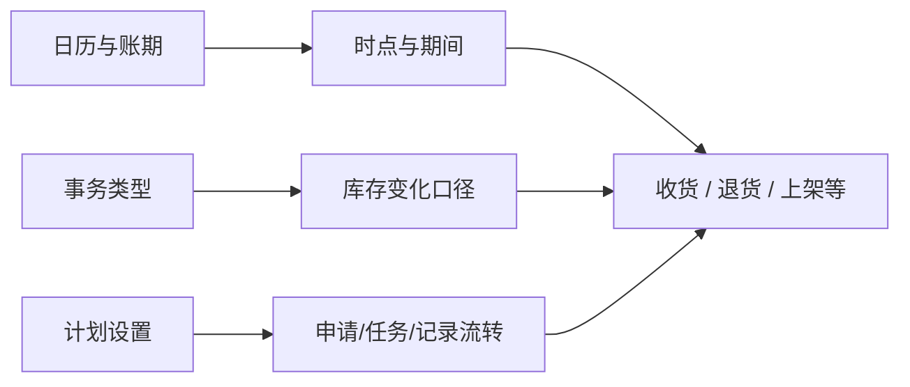

# WMS 系统设置

> 适用基线：测试环境 / `dev` 分支 / 2026-07-15。
> 阅读对象：测试、实施（主）；WMS 运行配置人员（顺带）。

## 这一组解决什么问题 / 功能范围

系统设置维护影响 WMS 运行节奏与处理方式的受控配置：系统日历（可用时段）、账期日历（业务期间）、事务类型（库存变化口径）、计划设置（申请/任务/记录自动流转）。

**这不是普通主数据。** 错误变更可能影响新业务创建、是否允许负库存、自动处理程度或期间归属；生产变更须先影响评估与测试验证。

## 如何使用本组文档（测试 / 实施）

| 你的目的 | 建议阅读 |
| --- | --- |
| 设计「改计划设置/事务类型 → 行为变化」验证 | **本页**依赖概览 → 对应叶页主文档 |
| 维护字段、导入、启停细节 | 同对象**维护与查询参考**（事务类型、计划设置等） |
| 验证入库链受配置影响 | 先配日历/事务/计划 → [采购收货](../03-采购收货/index.md) 再跑场景 |

售前介绍请停在 [WMS 模块首页](../index.md)，**不要**在介绍路径中改生产设置。

## 本组学习顺序

| 顺序 | 页面 | 先解决什么 | 与业务怎样衔接 |
| --- | --- | --- | --- |
| 1 | [系统日历](01-系统日历.md)、[账期日历](02-账期日历.md) | 处理时段与期间口径 | 收货/退货/上架的时间与期间查询 |
| 2 | [事务类型](03-事务类型.md) | 库存动作与负数等策略 | 出入库库存结果共同口径 |
| 3 | [计划设置](04-计划设置.md) | 申请/任务/记录自动处理 | 入库链如何进入现场执行与记录 |

## 配置依赖概览

| 配置 | 影响什么 | 在哪确认 |
| --- | --- | --- |
| 系统日历 | 模块可用时段 | 本页 + 业务是否拦截 |
| 账期日历 | 期间归属与跨期查询 | 本页 |
| 事务类型 | 库存变动业务口径、负数策略 | 本页 + 库存/业务结果 |
| 计划设置 | 自动提交/通过/生成任务或记录 | 本页 + 各业务主文档 |

## 本组页面一览

| 页面 | 文档形态 | 说明 |
| --- | --- | --- |
| [系统日历](01-系统日历.md) | 主文档 | 模块时段、启停与变更风险 |
| [账期日历](02-账期日历.md) | 主文档 | 年月期间与停用风险 |
| [事务类型](03-事务类型.md) | 主文档 + [维护参考](05-事务类型-维护与查询参考.md) | 库存动作口径 |
| [计划设置](04-计划设置.md) | 主文档 + [维护参考](06-计划设置-维护与查询参考.md) | 自动流转；高风险 |

## 常见提醒

具体哪些入库业务读取每项配置、何时生效，以各业务事实页与测试环境为准；勿把本页关系图当成「已全部接通」的证明。
