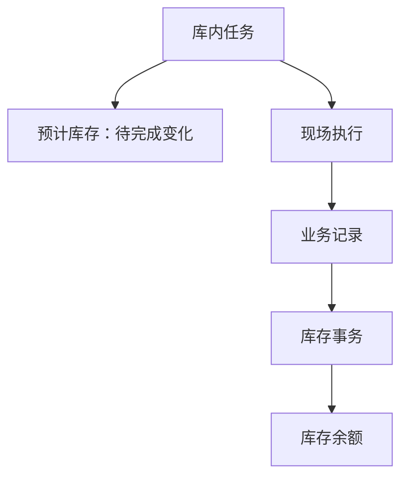

# 库内作业

> 适用基线：测试环境目标 / `dev` 分支 / 2026-07-15。
> 阅读对象：测试、实施（主）；仓库主管、库内作业与库存管理人员（顺带）。

## 分组导读（测试 / 实施）

| 你的目的 | 建议阅读 |
| --- | --- |
| 理解内部库存为何及如何受控变化 | **本页**（主文档：分类、判断、库存影响） |
| 发起申请、承接任务、PDA 或追溯细节 | [库内作业-维护与查询参考](库内作业-维护与查询参考.md) |
| 售前介绍 | 停在 [WMS 模块首页](../index.md) |

**学习顺序：** 先分清作业类型（调拨/转移/状态转移/计划外/报废）→ 本页通用流程 → 各子类型勿互套状态机 → 差异闭环走[盘点管理](../12-盘点管理/index.md)。

**配置依赖概览：** DBC 仓位与物料；事务类型；审批/授权；扫码与数量门禁见维护参考。通用对象见[申请、任务与记录模型](../../02-业务模型/01-申请任务记录模型.md)。

## 业务目的与适用范围

库内作业处理库存仍在企业内部、但地点/状态/数量需受控变化的场景（调拨、库内转移、库存状态转移、计划外出入库、报废等），让每次变化有来源、过程与结果，避免直接改余额。

读完应能说清：本组功能范围、分类边界，以及与盘点的分工。

## 使用前准备

| 需要确认什么 | 为什么重要 |
| --- | --- |
| 作业类型与业务原因 | 区分调拨、库内转移、状态转移、计划外出入库或报废。 |
| 源库存与目标去向 | 明确物料当前在哪里、要转到哪里，或为何需要减少。 |
| 物料、数量、批次、包装和库存状态 | 确保变化作用于正确的库存追溯单元。 |
| 责任人、审批或授权 | 防止无来源、无权限的库存调整。 |
| 现场搬运或处置方式 | 决定是否需要扫描、复核、交接或报废凭证。 |

!!! example "📷 截图占位"
    选择库内作业类型并建立申请的页面，标出来源库存、目标地点/状态、物料、数量和原因。

## 库内作业通用流程

申请说明“为什么要变”，任务组织“谁去做”，记录保存“实际怎么变”。即使只是同仓库内转移，也应保留来源、目标和实际数量。

多数调拨、库内转移和状态转移共用同一套库存转移对象，再按业务类型区分入口；计划外出入库和报废是独立对象链。培训时应先选对菜单，再执行现场动作。

!!! example "📝 示例数据占位"
    原料库位调拨到线边库位，以及一笔报废处置；展示申请、任务、记录和库存变化。

### 关键判断

| 判断点 | 应先确认什么 | 判断后的影响 |
| --- | --- | --- |
| 是否应做库内作业 | 变化是否属于内部地点、状态或计划外数量调整，而非盘点差异。 | 决定入口：库内作业还是盘点调整。 |
| 用哪类作业 | 是地点变化、状态变化、计划外数量还是报废。 | 决定菜单、审批和库存动作。 |
| 如何现场执行 | 是否要求扫描、是否允许改数量/库位、来源余额是否足够。 | 决定 Web/PDA 操作方式。 |
| 如何确认完成 | 业务记录、库存事务和余额是否可追溯。 | 决定本次变化是否生效。 |

### 关键字段业务角色

完整选择器与分类型差异见[维护与查询参考](库内作业-维护与查询参考.md)。多数调拨/库内转移/状态转移共用转移对象族，再按**业务类型**区分；计划外与报废为独立链。盘点差异应走[盘点管理](../12-盘点管理/index.md)。来源余额选择通例见[通用选择器过滤惯例](../../02-业务模型/12-通用选择器过滤惯例.md)；目标仓→区→位见[库位与仓储级联惯例](../../02-业务模型/13-库位与仓储级联惯例.md)。

| 字段/配置点 | 在系统中的作用 | 关键行为要点（取值/范围/联动/门禁） | 维护或操作时要警惕什么 |
| --- | --- | --- | --- |
| 作业类型 / 业务类型 | 决定菜单路径与库存动作 | 地点变化 vs 状态变化 vs 计划外数量 vs 报废 | 选错类型会走错审批与事务 |
| 来源库存余额 | 明确“从哪一笔库存变” | 按唯一粒度选择且可用量足够，见[库存管理精度与唯一粒度](../../02-业务模型/08-库存管理精度与唯一粒度.md) | 找不到可移动库存时先查状态/冻结 |
| 目标库位 / 目标状态 | 明确“变到哪里/何种状态” | 仓—区—位级联；状态转移不得绕过质量放行 | 来源目标不清不得发起 |
| 数量与原因 | 受控变化依据 | 计划外/报废必须有合法原因与审批 ❓ | 勿用计划外消掉盘点差 |
| 申请/任务/记录状态 | 门禁 | 相关类型可建预计出/入；完成建事务并清理预期；转移预计入存在分支差异（`GAP-042`） | 完成了但库存没变先查记录与事务 |

## 常见作业类型

| 作业类型 | 业务目标 | 对象关系要点 |
| --- | --- | --- |
| 调拨出库/入库 | 在仓库或组织间转移库存。 | 菜单独立，执行上属于库存转移业务类型之一。 |
| 库内转移 | 改变库存地点，通常仍在企业内部仓储网络中。 | 申请—任务—记录齐全；任务可形成预计出。 |
| 状态转移 | 在合格、隔离、报废、线边等库存状态之间转换。 | 与库内转移共用对象族，按状态转移入口区分。 |
| 计划外出/入库 | 处理不由常规采购、生产或销售主链直接触发的数量变化。 | 独立申请—任务—记录；出库走预计出，入库走预计入。 |
| 报废出库 | 对无法继续使用的库存形成受控处置。 | 独立申请—任务—记录，通常形成出库结果。 |
| 物料拆解等其它入口 | 处理特殊形态或拆分场景。 | 不一定是标准申请—任务—记录；规则待专项确认。 |

## 角色与关键动作

| 角色/岗位 | 典型工作 |
| --- | --- |
| 申请发起人 | 选择正确作业类型，核对来源、目标、物料和原因。 |
| 审核或处理人员 | 推进申请进入可执行任务。 |
| 仓库执行人员 | 承接任务，完成扫码、搬运或处置，形成记录。 |

| 所属对象 | 常见动作 | 业务结果 |
| --- | --- | --- |
| 申请 | 新增、修改、提交、处理、关闭、导入（如开放）。 | 将内部变化需求推进为任务，或结束申请。 |
| 任务 | 承接、执行、关闭。 | 现场完成变化；相关类型会创建或清理预计库存。 |
| 记录 | 查询、必要时撤销或反向处理。 | 形成库存事务并更新余额。 |

!!! example "📐 图示占位"
    按作业类型区分的状态与动作图；以测试环境为准。

## 对库存和相关业务的影响

当前可确认的通用关系是：

1. 申请处理生成任务后，转移类、计划外出库类、报废类通常会形成预计出或预计入，表达待完成变化。
2. 任务或记录完成后形成库存事务，并更新库存余额。
3. 完成时会清理与任务相关的预计库存；转移类中预计入的创建路径存在分支差异，不能假定所有入口表现一致。
4. 库存结果应以业务记录和库存事务追溯，不得手工改余额替代库内作业。

| 关联业务 | 应关注什么 |
| --- | --- |
| 库存管理 | 源/目标库存、事务、余额和最后变化记录。 |
| 盘点管理 | 差异是否应通过盘点调整而非普通库内作业处理。 |
| 质量管理 | 状态变化是否由检验、隔离或放行结论触发。 |
| 终端操作 | 扫码搬运、容器移动或现场异常处理。 |

## 查询、详情与联查

| 想解决的问题 | 推荐定位方式 | 建议联查 |
| --- | --- | --- |
| 哪些库内作业待执行 | 作业类型、任务状态、来源/目标库位或执行人。 | 申请、任务明细。 |
| 某批库存为何换了地点/状态 | 物料、批次/包装、库存事务或业务记录。 | 来源申请、目标地点。 |
| 报废或调整是否已生效 | 业务记录、数量、原因和处理时间。 | 库存事务、库存余额。 |

### 详情分组与快速跳转

| 分组 | 应展示什么 | 可联查什么 |
| --- | --- | --- |
| 作业原因与类型 | 作业类型/业务类型、原因。 | — |
| 来源与目标 | 来源余额、目标库位/状态。 | 库存余额、库位资料。 |
| 物料与数量 | 物料、数量、批次/包装。 | 物料、库存事务。 |
| 现场执行 | 扫描、执行人、差异。 | PDA 终端记录。 |
| 库存影响 | 预计出/入、事务与余额。 | 库存预期、库存事务、余额。 |
| 系统信息 | 创建、更新与审计。 | — |

!!! example "📷 截图占位"
    库内作业申请/任务/记录详情分组与库存联查；状态：待截图。

## 常见问题与处理

| 情况 | 建议处理 |
| --- | --- |
| 找不到可移动库存 | 核对物料、库位、库存状态、冻结和批次/包装。 |
| 来源与目标不一致 | 停止执行，核对作业类型、地点和扫描结果。 |
| 想直接调整数量 | 先判断是否应走盘点调整、报废或其它有原因的业务流程。 |
| 执行完成但库存没有变化 | 查询业务记录、库存事务和余额，并确认任务是否真正完成。 |
| 分不清调拨和状态转移 | 先看要改变的是地点还是库存状态，再进入对应菜单。 |

## 当前限制与待确认事项

- 库存转移中预计入创建在不同执行分支间可能不一致，不能把某一种路径写成全部入口的固定规则；
- 调拨、状态转移、计划外、报废的审批、撤销和反向库存影响需测试验证；
- 物料拆解、冻结解冻、形态转换等相邻入口仅作边界说明，规则待专项取证；
- AGV/容器移动和扫码规则需结合现场页面补充。

## 待补充的图示与示例
| 类型 | 后续需要补充的内容 | 目的 |
| --- | --- | --- |
| 分类图 | 各类库内作业的触发条件和应使用的业务入口。 | 帮助用户选对流程。 |
| 通用流程图 | 申请、任务、记录和库存结果。 | 解释为什么不能直接改库存。 |
| 现场截图 | 转库、扫描、报废确认和异常提示。 | 支持库内操作培训。 |
| 示例数据 | 调拨、状态转移、计划外、报废四类样例。 | 支持追溯与异常讲解。 |
