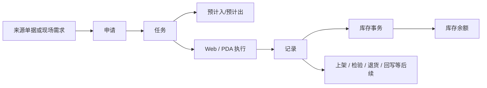

# WMS 库房管理

> 适用基线：测试环境目标 / `dev` 分支 / 2026-07-15。
> 阅读对象：测试、实施（主）；仓库/生产物流/盘点/PDA 现场角色（顺带）。

## 模块解决什么问题

WMS（库房管理）把仓储业务意图落实为可执行的现场工作，并沉淀为可查询、可追溯的库存结果。覆盖到货收货与上架、生产用料与收料、销售发货、库内移动、盘点调整，以及库存查询与终端操作。

上游单据或现场需求说明「要做什么」；WMS 组织为申请、任务与执行记录；执行后通过库存预计、事务与余额表达「将发生什么、发生了什么、目前还剩什么」。名称相似的业务不能互相套用状态与数量规则，须按各分组主文档确认。

**不在本模块：** 物料/供应商/客户/仓位/工艺等基础事实由 [DBC](../04-DBC-主数据管理/index.md) 维护。PDA/线边端是现场执行入口，业务规则以对应 WMS 业务页为准，不另起独立规则体系。

售前/对外介绍读到本节与下方「功能范围」即可停下，**不必**进入各组维护参考与字段长表。

## 功能范围

| 分组 | 覆盖什么 | 不覆盖什么 |
| --- | --- | --- |
| [基础数据](01-基础数据/index.md) | 销售价格、产品类/科目、ERP 成本中心/项目、标签入口 | DBC 物料/仓位主数据；标签模板长期归平台 |
| [系统设置](02-系统设置/index.md) | 系统/账期日历、事务类型、计划设置 | 各业务单据本身的现场作业细则 |
| [采购收货](03-采购收货/index.md) | 到货申请→任务→记录与库存入账 | 采购订单本体（SCP）；检验判定（QMS） |
| [采购退货](04-采购退货/index.md) | 来料退回供应商的闭环 | 供应商主数据维护 |
| [采购上架](05-采购上架/index.md) | 收货后入目标库位 | 收货登记本身 |
| [发料管理](06-发料管理/index.md) | 生产备料/发料/补料 | MES 报工与工艺执行 |
| [生产收料](07-生产收料/index.md) | 生产侧收料、退料、隔离 | 生产订单计划本体 |
| [生产管理](08-生产管理/index.md) | 制品收货、拆解、返修与上架衔接 | MES 工单主链 |
| [库存管理](09-库存管理/index.md) | 预计/事务/余额查询与追溯 | 主数据定义；盘点执行过程见盘点分组 |
| [销售出库](10-销售出库/index.md) | 备货、发货、客户退货相关仓储 | 销售订单本体（SCP） |
| [库内作业](11-库内作业/index.md) | 调拨、转库、报废、计划外出入库等 | 盘点差异闭环见盘点 |
| [盘点管理](12-盘点管理/index.md) | 盘点计划、实盘、差异调整 | 财务关账规则细节 |
| [终端操作](13-终端操作/index.md) | PDA/线边承接与扫码执行入口 | 不重写 Web 侧业务规则 |

## 测试 / 实施从哪读

| 你的目的 | 建议路径 |
| --- | --- |
| 验证「到货→收货→上架→余额」主链 | [采购收货](03-采购收货/index.md)（W1 定标）→ [采购上架](05-采购上架/index.md) → [库存管理](09-库存管理/index.md) |
| 讲清申请/任务/记录与预计/事务/余额 | 本页「库存结果框架」→ [库存管理](09-库存管理/index.md) → 共享模型链接 |
| 配置日历/事务类型/自动流转后再验业务 | [系统设置](02-系统设置/index.md) → 再跑对应业务分组 |
| 设计发料/生产收料与 MES 边界场景 | [发料管理](06-发料管理/index.md)、[生产收料](07-生产收料/index.md) + [MES](../06-MES-生产管理/index.md) |
| 现场 PDA 与 Web 对照 | [终端操作](13-终端操作/index.md) + 对应业务主文档（规则以 Web 业务页为准） |

**建议学习顺序：** DBC 主数据与 WMS 基础/系统设置 → 库存三类对象 → 入库主线 → 出库主线 → 库内与盘点 → 终端执行。

## 配置依赖概览

| 配置 / 主数据 | 影响什么 | 在哪确认 |
| --- | --- | --- |
| DBC 物料、包装、仓/区/位、伙伴、业务类型 | 任务可选对象、地点与单据分类 | [DBC](../04-DBC-主数据管理/index.md) |
| 系统日历 / 账期日历 | 可作业时段与期间归属 | [系统设置](02-系统设置/index.md) |
| 事务类型 | 库存变动口径、是否允许负数等 | [系统设置](02-系统设置/index.md) |
| 计划设置 | 申请/任务/记录自动提交、生成与流转 | [系统设置](02-系统设置/index.md) |
| 标签与条码、价格/科目资料 | 扫码识别、结算解释（按业务是否读取） | [基础数据](01-基础数据/index.md) |
| 各业务任务配置（少收/多收/扫码/库位等） | 现场可执行范围与门禁 | 各业务**主文档**「配置如何起作用」 |

通例见[申请、任务与记录模型](../02-业务模型/01-申请任务记录模型.md)、[库存数据挂接模型](../02-业务模型/02-库存数据挂接模型.md)、[库存管理精度与唯一粒度](../02-业务模型/08-库存管理精度与唯一粒度.md)。

## 一笔仓储业务如何形成库存结果

采购收货已验证「任务→预计入、记录→事务→余额」样板；其它业务是否同构、何时更新，以各分组主文档为准。

## 跨模块边界

| 协作对象 | WMS 依赖什么 | WMS 产生什么 | 追溯怎么走 |
| --- | --- | --- | --- |
| DBC | 物料、地点、伙伴、包装、部分策略 | 任务、记录、库存结果 | 识别问题回 DBC；数量回 WMS |
| SCP | 采购订单/送货、销售协同来源 | 收货、退货、出库相关结果 | 从来源单定位 WMS 申请/任务/记录 |
| MES | 生产需求或产出相关信息 | 发料、生产收料、制品入仓结果 | 生产侧回 MES；库存变动回 WMS |
| QMS | 检验要求或质量判断 | 待检/隔离/退货等仓储处理结果 | 质量结论回 QMS；库存状态回 WMS |

## 使用本模块前需要准备什么

| 需要准备什么 | 为什么需要 |
| --- | --- |
| 可用的物料、伙伴、仓位、包装与业务类型 | 决定任务能否正确带入对象与地点 |
| 当前业务来源（到货/发料/发货/盘点等） | 选对分组与验证场景 |
| 执行角色与终端条件 | 谁可承接、是否扫码/PDA |
| 差异处理原则 | 少收、拒收、库位不符、盘点差异时不绕过流程 |

## 术语与相关文档

| 主题 | 建议阅读 |
| --- | --- |
| 申请 / 任务 / 记录 | [申请、任务与记录模型](../02-业务模型/01-申请任务记录模型.md) |
| 预计 / 事务 / 余额 | [库存数据挂接模型](../02-业务模型/02-库存数据挂接模型.md) |
| 主数据入口 | [DBC 主数据管理](../04-DBC-主数据管理/index.md) |
| 入库样板 | [采购收货](03-采购收货/index.md) |
| 标签打印归属 | [标签、条码与打印](../03-基础设施/01-标签、条码与打印.md) |
