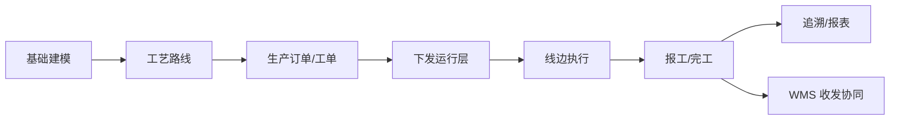

# MES 生产管理

> 适用基线：测试环境目标 / `dev` 分支 / 2026-07-15。
> 阅读对象：测试、实施（主）；工艺/计划/线边执行相关业务人员（顺带）。

## 模块解决什么问题

MES（生产管理）把「按什么工艺、排什么工单、在线边如何执行、结果如何追溯」落实为可配置、可验证的生产运行过程。它承接工艺与计划，驱动线边报工/转序/完工，并为质量、仓储、设备协同提供生产侧事实。

**不在本模块：** 库存余额与出入库事务以 [WMS](../05-WMS-库房管理/index.md) 为准；共享工厂/物料主数据以 [DBC](../04-DBC-主数据管理/index.md) 为准；过程检验判定细则回 [QMS](../07-QMS-质量管理/index.md)；排程算法与甘特归 [PS](../11-PS-排程管理/index.md)（规划中）。WMS PDA 不属于 MES 终端。

售前/对外介绍读到本节与下方「功能范围」即可停下，**不必**进入各组维护参考与字段长表。

## 功能范围

| 分组 | 覆盖什么 | 不覆盖什么 |
| --- | --- | --- |
| [基础建模](01-基础建模/index.md) | 线边客户端、SOP、技能要求、开工点检、线边库、生产 BOM | DBC 工厂/工位主数据；EAM 设备点检执行 |
| [工艺管理](02-工艺管理/index.md) | MES 工艺路线、版本、图形、转序/并行、运行快照 | DBC 工序字典；检验方案本体 |
| [计划管理](03-计划管理/index.md) | ERP/生产订单、工单下发与状态、并行组 | WMS「生产计划」菜单；PS 排程算法 |
| [终端操作](06-终端操作/index.md) | 线边领作业、报工、门闸、上下工 | WMS PDA 收发货 |
| [追溯管理](04-追溯管理/index.md) | 正逆向追溯、追溯码规则 | 现场采集本身 |
| [报表统计](05-报表统计/index.md) | 报工/完工/点检/上下工记录查询 | 积木报表设计器 |

## 测试 / 实施从哪读

| 你的目的 | 建议路径 |
| --- | --- |
| 设计开产 / 报工 / 转序验证场景 | 本页边界 → [计划管理](03-计划管理/index.md) → [终端操作](06-终端操作/index.md) → 需要时进同组维护参考 |
| 配置线边开产底座 | [基础建模](01-基础建模/index.md) → [工艺管理](02-工艺管理/index.md) |
| 讲清「改配置 → 现场行为变化」 | 各组**主文档**（逻辑与配置）；细节与选择器进同组**维护参考** |
| 查过程与客诉排查 | [报表统计](05-报表统计/index.md) / [追溯管理](04-追溯管理/index.md) |

**建议学习顺序：** 基础建模 → 工艺管理 → 计划管理 → 终端操作 → 追溯 / 报表。

## 配置依赖概览

| 配置 / 主数据 | 影响什么 | 在哪确认 |
| --- | --- | --- |
| DBC 工厂 / 工位 / 物料 / 工序 / 技能 | 可选资源与主数据口径 | [DBC](../04-DBC-主数据管理/index.md) |
| 线边客户端、SOP、点检、线边库 | 能否登录、指导书、开产拦截、线边库存协同 | [基础建模](01-基础建模/index.md) |
| 工艺路线版本、转序门槛、分派模式 | 工单能否下发、如何领作业 / 转序 | [工艺管理](02-工艺管理/index.md) |
| 任务模式、并行组、工单状态动作 | 报工粒度与生命周期 | [计划管理](03-计划管理/index.md) |
| 追溯码规则 | 赋码 / 解析能否成功 | [追溯管理](04-追溯管理/index.md) |

本模块无独立「业务类型 / 单据设置」专页时，仍受权限与 DBC 策略通例约束；通例见[单据类型、业务类型与单据配置](../02-业务模型/05-单据类型、业务类型与单据配置.md)。

## 典型业务全景

## 跨模块边界

| 边界 | 口径 |
| --- | --- |
| vs DBC | 物料、工厂建模、工序字典等在 DBC；工艺路线维护主体在 MES；技能等级 / 人员技能菜单当前多在 DBC |
| vs WMS | 投料 / 完工引起的库存变动以 WMS 事务与余额为准 |
| vs QMS | 过程检验、不良判定细则回 QMS；追溯可作客诉排查入口 |
| vs PS / ERP | ERP 订单可转换入 MES；排程算法与结果对比仍归 PS（规划中） |

## 未决（文末；不挡地图阅读）

- 菜单分组不能穷尽全部后端能力；未覆盖项见各组文末。
- `GAP-071`：MES 报工 NG → QMS 建单映射未证实。
- 各组 `MES-*` 待确认项见对应分组页文末。
