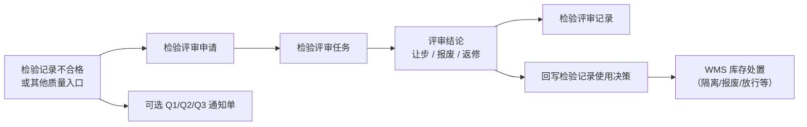

# 质量评审

> 适用基线：测试环境目标 / `dev` 分支 / 2026-07-15。
> 阅读对象：测试、实施（主）；质量评审岗、MRB、仓储协同（顺带）。

## 这一组解决什么问题 / 功能范围

质量评审处理检验不合格后的处置决策，覆盖：

1. **检验评审**申请 / 任务 / 记录：让步、报废或返修等结论，并可回写检验记录使用决策。
2. **质量通知**：Q1 / Q2 / Q3（客诉/供应商索赔/问题跟踪等，与评审 ATR 并存）。

**注意：** WMS「质量评审 / 待评审物料」是仓储侧待处置库存视角，**不是**本组检验评审 ATR。库存隔离/放行/报废出库等事务仍以 WMS 为准。

## 如何使用本组文档（测试 / 实施）

| 你的目的 | 建议阅读 |
| --- | --- |
| 设计不合格闭环验证 | **本页**（主文档） |
| 做检验评审或通知单操作细节 | [质量评审-维护与查询参考](质量评审-维护与查询参考.md) |
| 查来料/生产/客退原单 | 对应检验分组主文档 |

## 本组学习顺序

1. 挂接来源检验记录 → 2. 检验评审 ATR（让步/报废/返修）→ 3. 回写使用决策 → 4. WMS 库存处置 → 5. 需要时开 Q1/Q2/Q3。

## 配置依赖概览

| 依赖 | 影响 | 在哪确认 |
| --- | --- | --- |
| 来源检验记录与结论 | 评审挂接事实 | 来料/生产/客户检验 |
| 包装/批次/库位等明细 | 处置对象可定位到库存 | 评审明细 + WMS |
| 审批流 / 评审人 | 任务能否推进 | 流程与权限 |
| 是否开通知单 | Q1/Q2/Q3 与评审结论分工 | 本页通知单 |

本组无独立「免检类」配置；结论后是否**自动**开 WMS 处置单 ❓（见模块首页未决）。

## 使用前准备

| 需要确认什么 | 为什么重要 |
| --- | --- |
| 来源检验记录号与结论 | 评审挂接检验事实。 |
| 包装/批次/库位等库存定位（明细） | 处置对象可追溯到库存。 |
| 审批流/评审人 | 任务含流程实例与节点名线索。 |
| 是否需要通知单 | Q1/Q2/Q3 字段面向索赔与责任人，与评审结论分工。 |

!!! example "📷 截图占位"
    检验评审申请（检验记录号、物料、结论）。

## 评审主流程

| 对象 | 业务含义 |
| --- | --- |
| 评审申请 | 提出对某物料/包装/检验记录的评审请求。 |
| 评审任务 | 评审执行；可含结论、评审人、时间、流程节点。 |
| 评审记录 | 固化评审结果。 |
| 明细 | 包装/批次/数量/库存状态/库位/仓库等定位信息。 |
| Q1/Q2/Q3 | 通知与索赔类单据；Q2 可含供应商、采购收货号、索赔金额等。 |

评审结论：让步、报废、返修。任务完成可将库存状态映射为检验记录使用决策（合格 / 报废 / 隔离）。

## 与检验执行、WMS、通知单的边界

| 协同方 | 本页负责 | 不在本页展开 |
| --- | --- | --- |
| 来料/生产/客户检验 | 挂接检验记录、更新使用决策 | 抽检录入细节 |
| WMS 库存移动/报废 | 给出处置结论线索 | 具体事务与余额 |
| WMS「质量评审」菜单 | 分清入口 | 待评审物料仓储作业 |
| ANDON | 异常升级线索（若组织使用） | 故障响应 SLA |
| Q1/Q2/Q3 | 通知/索赔事实 | 财务结算细则 |

## 关键判断

| 判断点 | 应先确认什么 | 影响 |
| --- | --- |
| 走评审还是只出通知单 | 组织 MRB 流程 | 避免只建 Q 单无结论 |
| 让步后能否使用 | 使用决策与 WMS 状态 | 让步≠已自动放行 |
| 报废 | 是否已有报废出库 | 防重复或漏处置 |
| 看错菜单 | QMS 检验评审 vs WMS 质量评审 | 对象不同 |

### 关键字段业务角色

| 字段/配置点 | 在系统中的作用 | 关键行为要点 | 警惕什么 |
| --- | --- | --- | --- |
| 来源检验记录号 | 挂接不合格事实 | 须已有检验记录 | 无来源难闭环 |
| 评审结论（让步/报废/返修） | 处置决策 | 可回写检验使用决策 | 让步≠WMS 已放行 |
| 明细库位/批次/包装 | 定位处置对象 | 追溯到库存粒度 | 定位错导致错处置 |
| Q1/Q2/Q3 通知单 | 索赔/客诉单据 | 与评审 ATR 并存、不替代结论 | 只建 Q 单无评审 |
| 评审 ATR 状态 | 门禁 | 申请→任务→记录 | — |

### 选择器范围（骨架）

通例见[通用选择器过滤惯例](../../02-业务模型/12-通用选择器过滤惯例.md)。下表只写本页差异；精确状态集与权限投影见 `FSEM-006` / `GAP-014`。

| 选择字段 | 选择对象 | 可选范围（当前可写） | 范围依赖 | 选不到时通常原因 |
| --- | --- | --- | --- | --- |
| 来源检验记录 | 来料/生产/客退检验记录 | 须已有检验记录；不合格出口常用 | 检验执行分组 | 未发布/无记录、跨类型找错单 |
| 物料 / 包装 / 批次 / 库位 | 明细定位 | 多由检验记录或库存线索带入 | 检验明细、WMS 粒度 | 定位不全→无法处置 |
| 评审结论 | 让步 / 报废 / 返修 | 任务完成可映射使用决策（合格/报废/隔离） | 评审任务状态 | 结论未回写当已放行 |
| 评审人 / 审批节点 | 用户与流程 | ❓ 流程实例与节点图以环境为准 | 审批流配置 | 无人可审、节点未配 |
| Q1/Q2/Q3 通知单 | 通知/索赔单据 | 与评审 ATR **并存**；❓ 是否自动互建未闭合（`GAP-016`） | 组织流程 | 只建 Q 单无评审结论 |
| WMS「质量评审」入口 | （对照） | **不是**本页检验评审 ATR | 仓储待评审物料 | 看错菜单对象 |

### 详情分组与快速跳转

| 分组 | 应展示什么 | 可联查什么 |
| --- | --- | --- |
| 来源检验 | 检验记录号、物料、原判定。 | 来料/生产/客户检验。 |
| 评审结论 | 让步/报废/返修、评审人、节点。 | — |
| 库存定位 | 包装/批次/数量/库位/仓库。 | WMS 余额与待评审物料。 |
| 通知与索赔 | Q1/Q2/Q3 单据键。 | 供应商/客诉上下文。 |
| 回写与后续 | 使用决策回写、WMS 处置线索。 | WMS 隔离/报废/放行。 |
| 系统信息 | 创建、更新与审计。 | — |

!!! example "📷 截图占位"
    检验评审详情分组与来源检验/WMS 联查；状态：待截图。

## 限制与待确认

- `GAP-016`：Q1/Q2/Q3 与评审强制先后/自动互建、评审结论→WMS 自动开单、现场审批回写待逐页核验。
- `FSEM-006`：来源记录/评审人选择器状态集与权限投影待测。
- 流程引擎字段（流程实例、当前节点）的具体审批图以环境为准。

!!! example "📝 示例数据占位"
    来料不合格记录 → 评审让步 → 使用决策更新 → WMS 隔离转合格。

