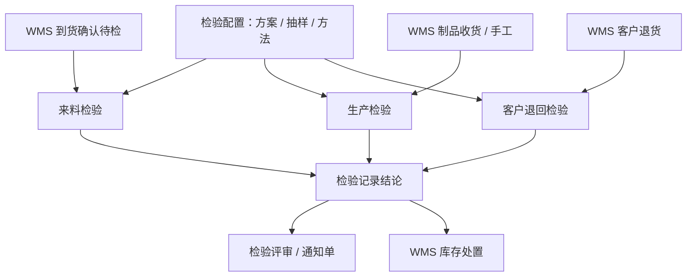

# QMS 质量管理

> 适用基线：测试环境目标 / `dev` 分支 / 2026-07-15。
> 阅读对象：测试、实施（主）；IQC / IPQC / 质量评审相关业务人员（顺带）。

## 模块解决什么问题

QMS（质量管理）把质量要求配置为可执行的检验方案，并沉淀来料、生产过程、客户退回等场景的检验申请—任务—记录，以及不合格后的检验评审与质量通知。读完本页应能说清：功能范围、测试实施从哪读、主要配置依赖，以及与 WMS / MES 的边界。

**不在本模块：** 库存隔离、放行、退货、报废等**事务写入以 [WMS](../05-WMS-库房管理/index.md) 为准**；生产报工与工单执行细节以 [MES](../06-MES-生产管理/index.md) 为准。通用 ATR 概念见[申请、任务与记录模型](../02-业务模型/01-申请任务记录模型.md)。

售前/对外介绍读到本节与下方「功能范围」即可停下，**不必**进入各组维护参考与字段长表。

## 功能范围

| 分组 | 覆盖什么 | 不覆盖什么 |
| --- | --- | --- |
| [检验配置](01-检验配置/index.md) | 抽样 / AQL、方法、模板、方案、动态加严、计数器 | 检验执行 ATR 细节 |
| [来料检验](02-来料检验/index.md) | 到货确认触发的 IQC 申请—任务—记录与回写 | 收货库存事务；已停用的收货「建检验」入口 |
| [生产检验](03-生产检验/index.md) | 首件 / 末件 / 巡检 / 其他四套 ATR | EAM 设备巡检；MES 报工 NG 自动建单（未证实） |
| [客户检验](04-客户检验/index.md) | 客户**退回**检验 ATR | 出货 OQC（无独立菜单证据） |
| [质量评审](05-质量评审/index.md) | 检验评审 ATR + Q1/Q2/Q3 通知单 | WMS「质量评审 / 待评审物料」仓储入口 |

## 测试 / 实施从哪读

| 你的目的 | 建议路径 |
| --- | --- |
| 设计来料 / 过程 / 客退检验验证场景 | [检验配置](01-检验配置/index.md) → 对应执行分组主文档 → 需要时进维护参考 |
| 讲清「改方案 / 免检 / 自动建单 → 行为变化」 | [检验配置](01-检验配置/index.md) 主文档；执行页只消费配置结果 |
| 核对到货触发与回写 | [来料检验](02-来料检验/index.md) + WMS 到货确认 / 采购收货边界 |
| 不合格闭环 | 执行记录 → [质量评审](05-质量评审/index.md) → WMS 库存处置 |

**建议学习顺序：** 检验配置 → 来料检验 → 生产检验 → 客户检验 → 质量评审。

**主文档 vs 维护参考：** 各组 `index.md` 写功能范围、主线、配置影响与验证点；同组 `*-维护与查询参考.md` 写操作步骤、选择器与字段细节。

## 配置依赖概览

| 配置 / 上游 | 影响什么 | 在哪确认 |
| --- | --- | --- |
| 检验方案（物料 + 检验类型）、免检、自动建申请 | 是否建单、抽什么、多严 | [检验配置](01-检验配置/index.md) |
| 抽样 / AQL / 动态规则 / 计数器 | 抽样数与加严 / 放宽 | [检验配置](01-检验配置/index.md) |
| WMS 到货确认待检行 | 来料检验主触发 | WMS 到货 / [来料检验](02-来料检验/index.md) |
| WMS 制品收货 / 客户退货规则 | 生产 / 客退检验触发 | [生产检验](03-生产检验/index.md)、[客户检验](04-客户检验/index.md) |
| 方案上 MES 工序码（可选） | 过程检验挂接线索 | [检验配置](01-检验配置/index.md)；自动映射 ❓ `GAP-071` |
| 「改库存状态」类开关 | 配置意图 | **真正改库存仍以 WMS 为准** |

## 典型业务全景

## 跨模块边界

| 模块 | QMS 负责 | 不在 QMS 展开 |
| --- | --- | --- |
| WMS | 触发建单、结论回写键、使用决策 | 库存事务、上架、隔离 / 报废移动 |
| MES | 工序码配置线索、不良协同 | 报工 NG 自动建单（未证实，`GAP-071`） |
| SCP / 销售 | 客退 / 索赔上下文 | 出货计划与结算 |
| ANDON | 异常升级线索 | 故障响应主链 |
| EAM | — | 设备 / 工装巡检（勿与过程巡检混淆） |

## 未决（文末；不挡地图阅读）

- `GAP-071`：MES 报工 NG → QMS 检验单据映射未证实。
- `GAP-016`：各组现场状态机、终端规则与跨模块回写待逐页核验。
- `FSEM-006`：检验 / 评审选择器精确状态过滤与权限投影待测。
- 生产检验类型码与制品收货触发的菜单展示关系；评审后是否自动开 WMS 处置单。
