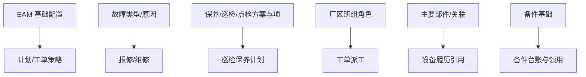

# 基础数据

> 适用基线：测试环境目标 / `dev` 分支 / 2026-07-15。  
> 阅读对象：**测试、实施（主）**；设备工程师（顺带）。操作见[基础数据-维护与查询参考](基础数据-维护与查询参考.md)。售前停在[模块首页](../index.md)。

## 这一组解决什么问题

基础数据为 EAM 的方案、故障分类、班组角色、部件与备件基础、文档类型等提供配置底座。设备/工装**身份台账**以 DBC 为准（EAM 菜单会嵌入 DBC 台账页）；本页只写 EAM 模块内已落地的配置对象。

旧概述中的虚构「EAM_CONFIG / FACTORY_WORKSHOP」英文字段表废弃，不以之为培训事实。

## 功能范围

| 本分组覆盖 | 不在本分组 |
| --- | --- |
| 故障类型/原因、保养巡检点检方案与项、班组角色、备件基础、EAM 库区库位、工作日历等 | DBC 设备/工装身份主维护 |
| 开计划/报修前的配置底座 | 计划审批与工单执行 → [巡检保养](../05-巡检保养/index.md)、[设备管理](../02-设备管理/index.md) |

## 测试与实施从哪读

| 你的目的 | 建议阅读 |
| --- | --- |
| 开计划前要配什么、边界 | **本页** |
| 维护方案、故障类型、班组角色 | [基础数据-维护与查询参考](基础数据-维护与查询参考.md) |
| 维护设备身份与现场归属 | DBC [设备台账管理](../../04-DBC-主数据管理/07-设备管理/02-设备台账管理.md) |
| 计划如何消费方案 | [巡检保养](../05-巡检保养/index.md) |
| 售前 | [EAM 模块首页](../index.md)；勿进维护参考 |

## 配置依赖概览

| 依赖 | 影响 |
| --- | --- |
| DBC 台账 / 车间产线工位 | 计划与工单能否挂对象 |
| 方案启用与适用类型 | 计划选得到/选不到方案 |
| 班组角色↔用户岗位 | 派工无人可接 |
| 工作日历 | 计划排程与出单节奏 |

## 使用前准备

| 需要确认什么 | 为什么重要 |
| --- | --- |
| DBC 设备/工装台账已建 | 计划与工单按设备/工装编码挂接。 |
| 车间/产线/工位主数据（DBC） | 组织定位与派工范围。 |
| 哪些故障类型、保养/巡检/点检方案启用 | 报修与计划生成依赖。 |
| 厂区班组角色与维修责任岗位 | 派工、接单与验证人匹配。 |

!!! example "📷 截图占位"
    EAM 基础数据菜单与故障类型列表；脱敏。

## 对象关系

| 对象 | 业务含义 |
| --- | --- |
| EAM 基础配置 | 模块级键值：标题、编码、配置值。 |
| 故障类型 / 故障原因 | 报修分类；可带标准工时、关联设备线索。 |
| 保养/巡检/点检方案与项、选择集 | 计划引用的检查/保养内容与选项集。 |
| 开拉方案与项（若启用） | 开拉计划底座。 |
| 厂区班组角色 | 派工对象与班组角色绑定。 |
| 主要部件 / 部件关联 | 设备结构部件及关联关系。 |
| 生产商 / 供应商（EAM 菜单） | EAM 侧厂商资料；与 DBC 生产商可能并存，勿当成同一张主数据。 |
| 备件基础、EAM 库区/库位 | 备件主数据与 EAM 库内定位（库存事务边界见[备件管理](../03-备件管理/index.md)）。 |
| 文档类型、扩展属性、故障率参数、生产时长 | 文档分类、扩展字段与指标辅助配置。 |
| 工作日历 | 计划排程与工单生成日历（菜单在 EAM 根下）。 |

## 与 DBC / 其它分组边界

| 协同方 | 本页负责 | 不在本页展开 |
| --- | --- | --- |
| DBC 设备/工装台账 | 引用编码 | 台账新增/导入/状态主维护 |
| DBC 车间产线工位 | 引用 | 工厂建模主维护 |
| 巡检保养 | 提供方案/项 | 计划审批、工单执行 |
| 设备管理 | 提供故障类型等 | 报修维修状态机 |
| 备件管理 | 提供备件基础 | 出入库与 WMS 同步 |

## 关键判断

| 判断点 | 应先确认什么 | 影响 |
| --- | --- | --- |
| 计划选不到方案 | 方案是否启用、编码是否匹配 | 无法建计划或生成空工单 |
| 报修故障类型缺失 | 故障类型/原因是否维护 | 分类统计与标准工时不准 |
| 派不到人 | 班组角色与用户岗位 | 工单停在待派工/待接单 |
| 台账在哪改 | 是否误在 EAM「虚构字段」改身份 | 应回到 DBC 台账页 |

### 关键字段业务角色

完整配置动作见[维护与查询参考](基础数据-维护与查询参考.md)。本表只列下游消费关键项。设备/工装身份在 DBC；车间/产线/工位为生产现场层级，**勿套用**仓→区→位通例。

| 字段/配置点 | 在系统中的作用 | 关键行为要点（取值/范围/联动/门禁） | 维护或操作时要警惕什么 |
| --- | --- | --- | --- |
| 故障类型 / 原因 | 报修分类与标准工时 | 报修必选；可关联设备线索 | 删已被历史引用的类型 |
| 保养/巡检/点检方案与项 | 计划引用底座 | 适用类型（设备/工装等）须匹配计划 | 方案停用导致计划选不到 |
| 厂区班组角色 | 派工/接单对象 | 与用户·岗位映射 | 映射空则待派工无人 |
| 主要部件 / 关联 | 设备结构履历 | 挂设备编码 | 与台账身份勿混改 |
| 备件基础 / EAM 库区库位 | 备件主数据与定位 | 库存权威在 WMS（见备件管理） | 当唯一库存真相 |
| 生产商 / 供应商（EAM） | EAM 侧厂商资料 | ❓ 与 DBC 生产商是否同步未证实 | 当同一张主数据双改 |

### 选择器范围（骨架）

通例见[通用选择器过滤惯例](../../02-业务模型/12-通用选择器过滤惯例.md)。本组多为配置侧选择器；身份台账「仅可选已存在 DBC 台账」。精确状态集与权限投影见 `FSEM-006` / `GAP-014`。

| 选择字段 | 选择对象 | 可选范围（当前可写） | 范围依赖 | 选不到时通常原因 |
| --- | --- | --- | --- | --- |
| 故障类型关联设备 | DBC 设备台账 | 须已存在台账；启停以台账页为准 | DBC 台账状态 | 未建台账、停用 |
| 方案适用对象类型 | 设备 / 工装等 | 与计划对象类型一致 | 方案启用态 | 类型不符、方案停用 |
| 检查项 / 选择集 | 方案项、选项集 | 已维护且可判定 | 方案编码 | 项未挂、选择集空 |
| 厂区班组角色 | 班组·角色·岗位 | ❓ 用户映射与投影未逐页实测 | 组织权限 | 无人可派、角色未配 |
| 车间 / 产线 / 工位 | 工厂建模 | 有效现场层级（非库位树） | 工厂建模 | 层级未建、跨厂 |
| 备件基础物料 | 备件主数据 | EAM 备件基础已建 | 基础数据 | 未建编码 |
| 生产商 / 供应商 | EAM 侧厂商 | 以本模块菜单为准；勿默认等同 DBC | 菜单可见性 | 找错模块、菜单隐藏 |

### 详情分组与快速跳转

| 分组 | 应展示什么 | 可联查什么 |
| --- | --- | --- |
| 故障分类 | 类型/原因、标准工时、关联设备线索。 | 设备管理报修。 |
| 方案底座 | 方案、项、选择集、适用类型。 | 巡检保养计划。 |
| 派工角色 | 班组角色与岗位映射。 | 设备管理派工。 |
| 备件与厂商 | 备件基础、EAM 库区库位、生产商/供应商。 | 备件管理；DBC 生产商（对照）。 |
| 系统信息 | 创建、更新与审计。 | — |

!!! example "📷 截图占位"
    故障类型与方案列表、班组角色维护；状态：待截图。

## 限制与待确认

- `GAP-016`：EAM↔DBC 生产商是否同步、部分基础菜单启停/隐藏、配置被计划/自动策略引用范围待环境核验。
- `FSEM-006`：方案/故障/班组/台账选择器精确状态过滤与 P13 投影矩阵待测。
- 部分基础菜单在菜单数据中可能停用或隐藏，以测试环境可见性为准。

!!! example "📝 示例数据占位"
    新建「月度保养方案」并挂三项检查项，供设备计划引用。

