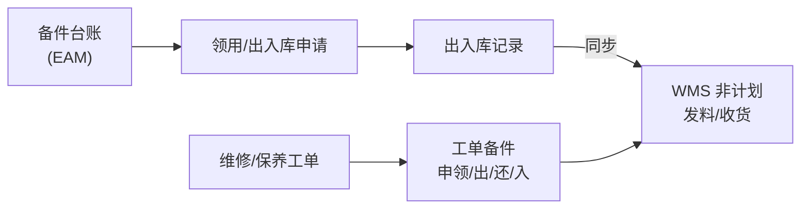

# 备件管理

> 适用基线：测试环境目标 / `dev` 分支 / 2026-07-15。  
> 阅读对象：**测试、实施（主）**；备件管理员、维修班组、仓库协同（顺带）。操作见[备件管理-维护与查询参考](备件管理-维护与查询参考.md)。售前停在[模块首页](../index.md)。

## 这一组解决什么问题

备件管理支撑维修/保养所需物料的台账、申领、出入库、盘点与工单备件执行。EAM 维护备件业务单据与模块内台账视图；**向 WMS 同步非计划出库/入库**已证实存在，库存余额与仓库事务以 WMS 为准。

## 功能范围

| 本分组覆盖 | 不在本分组 |
| --- | --- |
| EAM 备件台账视图、申领/出入库/盘点、工单备件路径、同步状态 | WMS 库存余额与仓储作业权威 |
| 维修/保养领用入口衔接 | 把 EAM 数量当唯一库存真相 |

## 测试与实施从哪读

| 你的目的 | 建议阅读 |
| --- | --- |
| EAM 备件 vs WMS 库存边界 | **本页** |
| 申领、出库、入库、盘点操作 | [备件管理-维护与查询参考](备件管理-维护与查询参考.md) |
| 维修领用 | [设备管理](../02-设备管理/index.md) |
| WMS 库存查询 | WMS [库存管理](../../05-WMS-库房管理/09-库存管理/index.md) |
| 售前 | [EAM 模块首页](../index.md)；强调「余额在 WMS」 |

## 配置依赖概览

| 依赖 | 影响 |
| --- | --- |
| 备件基础与台账编码 | 申领明细能否挂物料 |
| EAM 库区库位 ↔ WMS 映射、账期 | 同步成功/拒收 |
| 工单绑定 vs 独立领用路径 | 菜单与追溯口径不同 |

## 使用前准备

| 需要确认什么 | 为什么重要 |
| --- | --- |
| 备件基础与台账编码 | 申领明细挂物料。 |
| EAM 库区库位与 WMS 映射 | 同步失败常见原因。 |
| 账期/非计划出入库是否开放 | WMS 接口拒收。 |
| 工单备件还是独立领用 | 菜单路径不同。 |

!!! example "📷 截图占位"
    备件出库与 WMS 同步状态；脱敏。

## 对象关系

| 对象 | 业务含义 |
| --- | --- |
| 备件台账 | 物料、库区库位、数量、安全库存、科目等 EAM 视图。 |
| 领用申请 / 出库 / 出库记录 | 申领到出库闭环。 |
| 入库申请 / 入库记录 | 回收入库或采购入 EAM 视角。 |
| 盘点计划/工单/差异/调整 | EAM 备件盘点链。 |
| 备件事务 | 事务查询。 |
| 工单备件申领/出库/归还/入库 | 绑定维修等工单的执行路径；同步 WMS。 |

## 与 WMS 边界

| 本页负责 | 不在本页展开 |
| --- | --- |
| 发起申领/出入口径、同步状态（已同步/失败） | WMS 库存余额、上架、库存事务明细规则 |
| EAM 台账数量展示 | 把 EAM 当作唯一库存真相 |

同步失败时先查 WMS 回执与映射，勿只改 EAM 数量“抹平”。

## 关键判断

| 判断点 | 应先确认什么 | 影响 |
| --- | --- | --- |
| 出库成功但 WMS 无单 | 同步状态是否失败 | 两边账不一致 |
| 台账数量与 WMS 不符 | 是否未同步路径或盘点未回写 | 对账 |
| 维修无料 | 走工单备件还是独立领用 | 选错菜单 |

### 关键字段业务角色

完整动作见[维护与查询参考](备件管理-维护与查询参考.md)。本表只列主线关键项。库存余额与仓库事务以 WMS 为准；EAM 台账为业务视图。

| 字段/配置点 | 在系统中的作用 | 关键行为要点（取值/范围/联动/门禁） | 维护或操作时要警惕什么 |
| --- | --- | --- | --- |
| 备件台账数量 | EAM 结存视图 | 对账以 WMS 为准 | 只改 EAM 数量抹平 |
| 申领/出库数量与去向 | 可追溯领用 | 可挂设备或工单 | 无去向难追溯 |
| 同步状态 | 是否已写入 WMS | 已同步 / 失败需重试 | 失败后盲开 WMS 单 |
| 工单备件绑定 | 维修/保养领料路径 | 须关联有效工单 | 漏绑或选错工单 |
| EAM 库区库位 | 模块内定位 | 须与 WMS 映射一致 | 映射错导致同步拒收 |

### 选择器范围（骨架）

通例见[通用选择器过滤惯例](../../02-业务模型/12-通用选择器过滤惯例.md)。备件编码来自备件基础/台账；去向设备「仅可选已存在台账」。精确状态集与权限投影见 `FSEM-006` / `GAP-014`。

| 选择字段 | 选择对象 | 可选范围（当前可写） | 范围依赖 | 选不到时通常原因 |
| --- | --- | --- | --- | --- |
| 备件物料 / 台账行 | 备件基础·台账 | 已建编码；结存视图可查 | 基础数据、台账 | 未建编码、无结存 |
| EAM 库区 / 库位 | EAM 库内定位 | 已维护且与 WMS 可映射 | 库位映射、账期 | 映射缺失、账期关闭 |
| 去向设备 | DBC 设备台账 | 须已存在台账 | DBC 台账状态 | 未建台账、停用 |
| 关联维修/保养工单 | 维修或保养工单 | 工单备件路径可引用 | 工单状态 | 工单已关、路径未启 |
| 领用申请 / 出入库单 | 本模块单据 | 按独立领用或工单路径分流 | 菜单启用 | 选错菜单路径 |
| WMS 非计划出入库 | （同步目标） | 出/入库后回写单号；失败可查状态 | 账期、映射、接口 | 同步失败仍当成功 |

### 详情分组与快速跳转

| 分组 | 应展示什么 | 可联查什么 |
| --- | --- | --- |
| 台账结存 | 物料、库区库位、数量、安全库存。 | WMS 库存管理。 |
| 申领与出入库 | 申请、出/入库记录、同步状态。 | WMS 非计划发料/收货。 |
| 工单备件 | 绑定工单、出库/归还/入库回写单号。 | 设备管理、巡检保养。 |
| 盘点 | 计划/工单/差异/调整。 | ❓ 回写 WMS 完整链路待核验。 |
| 系统信息 | 创建、更新与审计。 | — |

!!! example "📷 截图占位"
    备件出库同步状态与工单备件绑定；状态：待截图。

## 限制与待确认

- `GAP-016`：是否所有出入库路径均强制同步 WMS、盘点调整回写 WMS 完整链路、终端备件规则待逐页核验。
- `FSEM-006`：备件/库位/工单/设备选择器精确状态过滤与 P13 投影矩阵待测。

!!! example "📝 示例数据占位"
    维修工单领用轴承 → 出库同步 WMS 非计划发料 → 回写单号。

