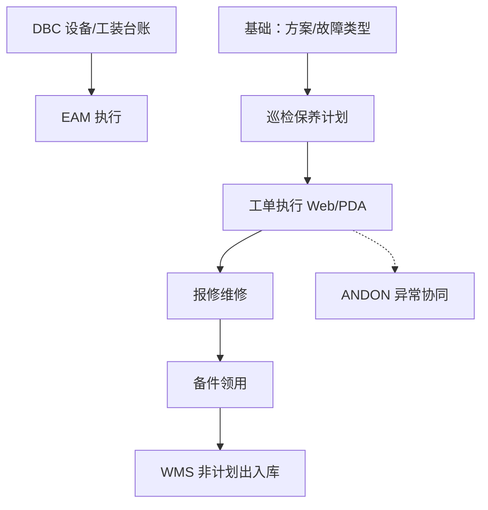

# EAM 设备管理

> 适用基线：测试环境目标 / `dev` 分支 / 2026-07-15。  
> 阅读对象：**测试、实施（主）**；设备/维修/巡检人员（顺带）。售前/对外介绍只读本节「模块解决什么问题」，**勿**默认进入各组维护与查询参考。

## 模块解决什么问题

EAM 把设备与工装的**运行维护执行**落成可派工、可执行、可验证的业务：到货验收与移动/变更、停机、报修→维修闭环、巡检/保养/点检（及可选开拉）、备件申领出入库，以及 EAM PDA 现场入口。

简单说：DBC 回答「设备/工装是谁、归属何处」；EAM 回答「坏了怎么修、该巡检谁做、备件怎么领」。备件出入库可同步 WMS 非计划发料/收货，**库存余额以 WMS 为准**。

## 功能范围

| 在本模块 | 不在本模块（去哪看） |
| --- | --- |
| 报修/维修、停机、验收/移动/变更履历 | 设备/工装**身份台账** → [DBC 设备管理](../04-DBC-主数据管理/07-设备管理/index.md) |
| 巡检/保养/点检计划→工单→记录 | QMS 过程质量巡检；MES 线边开工卡点细则 |
| 备件台账视图、申领/出入库/工单备件 | WMS 库存事务与余额 → [库存管理](../05-WMS-库房管理/09-库存管理/index.md) |
| EAM PDA 执行入口 | WMS PDA、MES 线边客户端 |
| 与 ANDON 的设备编码/转报修线索 | 呼叫到岗与响应链 → [ANDON](../09-ANDON-异常管理/index.md) |

## 测试与实施从哪读

| 你的目的 | 建议阅读 |
| --- | --- |
| 模块边界、学习顺序、配置依赖（本页） | **本页** |
| 某一分组主线、状态、跨模块边界 | 下表对应**分组 index** |
| 发起/派工/执行/验证、选择器与字段细节 | 各组 `*-维护与查询参考.md` |
| 设计验证场景（配置差异、状态门禁、WMS 同步） | 分组 index「关键判断」+ 维护参考；跨模块回查 DBC/WMS/ANDON |
| 售前 5～10 分钟介绍 | 仅「模块解决什么问题」+ 学习顺序表；**停在模块/分组地图，勿进维护参考** |

## 配置依赖概览

| 依赖层 | 改什么 / 先备什么 | 对现场行为的影响 |
| --- | --- | --- |
| DBC 设备/工装台账 | 编码、可用状态、现场归属 | 报修/计划选不到对象；EAM 不另建身份主数据 |
| EAM 基础数据 | 故障类型、保养/巡检/点检方案与项、班组角色、工作日历 | 分类、工单内容、派工对象、计划能否出单 |
| 计划参数 | 周期/cron、提前天数、自动策略（以环境为准） | 是否生成工单、何时出现待办 |
| 备件 ↔ WMS | 库区库位映射、账期、非计划出入库通道 | 同步成功/失败；余额以 WMS 为准 |
| 权限 / PDA 菜单 | 角色、终端菜单授权 | 谁看得见入口、谁能接单执行 |
| ANDON / 消息（协同） | 分类与响应链（若并联） | 异常呼叫与维修双轨时的关联口径（见 `GAP-016`） |

实施注意：改方案停用、班组映射或 WMS 映射前，应用「出计划工单 / 报修闭环 / 备件出库同步」三条短链做回归。

## 建议学习顺序

1. [基础数据](01-基础数据/index.md) — 方案、故障类型、班组角色。  
2. [设备管理](02-设备管理/index.md) — 台账边界与报修维修。  
3. [巡检保养](05-巡检保养/index.md) — 计划→工单→记录。  
4. [备件管理](03-备件管理/index.md) — 领用与 WMS 同步。  
5. [工装管理](04-工装管理/index.md) — 工装履历。  
6. [终端操作](06-终端操作/index.md) — PDA 入口。

## 业务分组

| 建议顺序 | 分组 | 学完能做什么 |
| --- | --- | --- |
| 1 | [基础数据](01-基础数据/index.md) | 配齐开计划/报修所需底座 |
| 2 | [设备管理](02-设备管理/index.md) | 走通报修→维修→验证 |
| 3 | [巡检保养](05-巡检保养/index.md) | 计划生成工单并执行闭环 |
| 4 | [备件管理](03-备件管理/index.md) | 领用并核对 WMS 同步 |
| 5 | [工装管理](04-工装管理/index.md) | 验收/出入库/变更履历 |
| 6 | [终端操作](06-终端操作/index.md) | 现场 PDA 与 Web 规则对齐 |

## 与其它模块边界

| 模块 | EAM 负责 | 不在 EAM 展开 |
| --- | --- | --- |
| DBC | 引用台账编码；验收/移动补丁 | 台账主数据导入与组织主维护 |
| WMS | 备件同步非计划出入库 | 库存余额与仓储作业 |
| MES | 设备编码被生产引用 | 线边报工、开工点检卡点细则 |
| ANDON | 设备异常协同线索 | 呼叫到岗与响应链 |
| QMS | — | 过程质量巡检（勿与设备巡检混淆） |

## 文末未决（不打断主线）

- `GAP-016`：停机↔ANDON、备件/工装与 WMS 同步完整路径、开拉/工艺维修启用、定时生成与终端规则等，待现场核验。  
- `FSEM-006`：台账/方案/派工/终端选择器精确状态过滤与 P13 投影矩阵待测。  
- 各组截图实拍另轨，不阻塞本模块地图使用。
