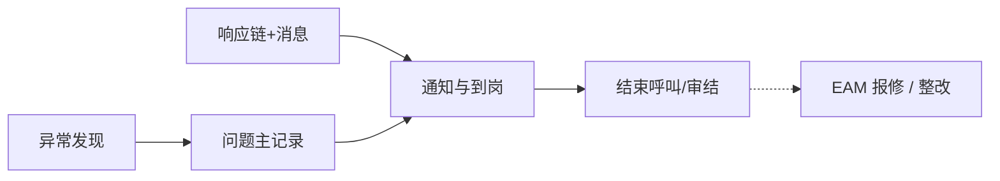

# ANDON 异常管理

> 适用基线：测试环境目标 / `dev` 分支 / 2026-07-15。  
> 阅读对象：**测试、实施（主）**；班组长、安灯管理员（顺带）。售前只读「模块解决什么问题」，**勿**默认进入维护与查询参考。

## 模块解决什么问题

ANDON 记录产线异常的**呼叫事实与过程到岗**，并配置「哪类问题由谁、在多长时间内响应、超时如何升级、用哪条消息」。它让异常从发现 → 通知 → 到岗 → 结束呼叫（可选审结/转维修/整改）可追溯。

不替代 EAM 维修工单，不替代 MES 报工/停线控制，也不替代 QMS 检验判定。

## 功能范围

| 在本模块 | 不在本模块（去哪看） |
| --- | --- |
| 问题主记录、过程到岗、停机项目（配置型） | EAM 报修审批与维修状态机 → [设备管理](../08-EAM-设备管理/02-设备管理/index.md) |
| 响应链、消息键、整改/OEE 线索（菜单以环境为准） | 系统消息通道投递与重试 → [消息通知](../12-系统管理/05-消息通知/index.md) / 基础设施消息页 |
| 来源可含安东异常、设备巡检、质量检验 | QMS 检验 ATR；EAM 巡检执行细则 |
| 与设备/模具/工单编码的关联线索 | MES 工单生命周期 |

## 测试与实施从哪读

| 你的目的 | 建议阅读 |
| --- | --- |
| 模块边界与配置依赖 | **本页** |
| 呼叫事实如何登记/关闭 | [故障记录](01-故障记录/index.md) |
| 响应链与消息如何配置 | [问题响应](02-问题响应/index.md) |
| 字段、选择器、日常操作 | 各组 `*-维护与查询参考.md` |
| 验证场景（分类匹配、到岗、超时升级是否部署） | 分组 index「关键判断」+ `GAP-016` 文末项 |
| 售前介绍 | 仅本页「解决什么问题」；停在地图层 |

## 配置依赖概览

| 依赖层 | 先备 / 改什么 | 行为影响 |
| --- | --- | --- |
| 问题分类 / 来源 / 类型码表 | 与现场口径一致 | 匹配不到响应链 → 无人通知 |
| 响应链 | 岗位顺序、标准时长、间隔、上级岗位、消息编号 | SLA、催促节奏、升级对象 |
| 组织岗位 | 岗位码有效且有人 | 通知找不到人 |
| 消息配置 | `msgId` 存在 | 链上有岗无内容 |
| 设备/模具/工单编码（可选） | DBC/MES 已有对象 | 跨模块联查；空键难追溯 |
| 调度任务（超时升级） | 是否在本环境部署 | 配置了时长≠一定自动升级（待核验） |
| 权限 / 菜单 | 整改、OEE 等入口是否挂出 | 配置有、入口无 |

## 建议学习顺序

1. [故障记录](01-故障记录/index.md) — 问题主记录与过程到岗。  
2. [问题响应](02-问题响应/index.md) — 响应链、消息、整改线索。

## 业务分组

| 分组 | 学完能做什么 |
| --- | --- |
| [故障记录](01-故障记录/index.md) | 登记呼叫事实、过程到岗、结束/审结线索 |
| [问题响应](02-问题响应/index.md) | 配响应链与消息，并理解与故障记录的分工 |

## 与其它模块边界

| 模块 | ANDON 负责 | 不在 ANDON 展开 |
| --- | --- | --- |
| EAM | 设备编码关联、可转报修线索 | 维修状态机与备件 |
| MES | 工单号等关联 | 停线控制与报工 |
| QMS | 来源可含质量检验 | 检验与评审 |
| 消息平台 | 业务消息键 | 通道投递 |

## 文末未决

- `GAP-016`：超时自动升级任务是否部署、整改/OEE 菜单完整性、巡检/质量来源自动建单触发点。  
- `FSEM-006`：分类/设备/岗位/消息选择器精确过滤与 P13 投影矩阵待测。  
- 截图实拍另轨。
