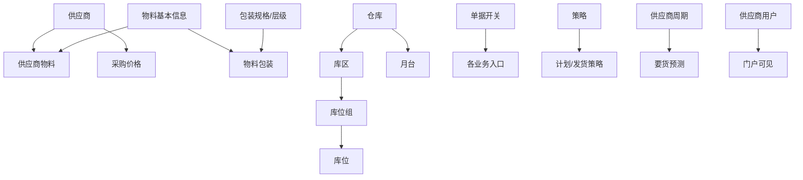

# 基础数据

> 适用基线：测试环境目标 / `dev` 分支 / 2026-07-15。  
> 阅读对象：**测试、实施（主）**；采购主数据维护（顺带）。操作见[基础数据-维护与查询参考](基础数据-维护与查询参考.md)。售前停在[模块首页](../index.md)。

## 这一组解决什么问题

基础数据为 SCP 协同单据提供供应商、物料、价格、包装、仓库/月台、单据开关、策略与供应商用户等配置底座。对象落在 SCP 自有表，**与 DBC 主数据并存**；培训时勿默认「改 SCP 等于改 DBC」。

旧页中虚构英文字段 ER、未经取证的信用等级规则等废弃。

## 功能范围

| 本分组覆盖 | 不在本分组 |
| --- | --- |
| SCP 侧供应商/物料/价格/包装/仓位月台/开关/策略/供应商用户 | DBC 企业主数据权威治理 |
| 标签与 SCP↔WMS 接口登记入口线索 | WMS 库存权威；订单/发货状态机 |

## 测试与实施从哪读

| 你的目的 | 建议阅读 |
| --- | --- |
| 开协同前要配什么 | **本页** |
| 维护供应商/物料/价格/开关 | [基础数据-维护与查询参考](基础数据-维护与查询参考.md) |
| 企业级供应商/物料权威 | DBC [供应商](../../04-DBC-主数据管理/02-供应商管理/01-供应商.md)、[物料](../../04-DBC-主数据管理/01-物料管理/01-物料基本信息.md) |
| 订单/发货如何消费 | [采购订单](../02-采购订单/index.md)、[发货协同](../05-发货协同/index.md) |
| 售前 | [SCP 模块首页](../index.md) |

## 配置依赖概览

| 依赖 | 影响 |
| --- | --- |
| 供应商可用态、供应商物料、价格有效期 | 下单范围与计价 |
| 单据开关 / 策略 | 业务入口是否开放 |
| 供应商用户绑定 | 门户可见范围 |

## 使用前准备

| 需要确认什么 | 为什么重要 |
| --- | --- |
| 供应商编码、联系人与可用状态 | 订单、计划、发货按供应商过滤。 |
| 供应商物料与采购价格有效期 | 下单计价与可订物料范围。 |
| 包装规格/物料包装 | 发货包装数量与标签打印。 |
| 仓库、库区、库位、月台（SCP 侧） | 计划到货仓/月台与发货到仓。 |
| 单据开关、策略、要货周期 | 控制入口与计划节奏。 |
| 供应商用户关联 | 门户登录可见范围。 |

!!! example "📷 截图占位"
    SCP 基础数据菜单与供应商列表；脱敏。

## 对象关系

| 对象 | 业务含义 |
| --- | --- |
| 供应商 | 协同对象编码、名称、联系、可用期。 |
| 供应商物料 | 供应商可供应物料、包装与结算相关属性。 |
| 物料基本信息 / 客户物料 | SCP 侧物料与客户物料关系。 |
| 物料包装 / 包装规格 / 层级 | 发货与标签用的包装定义。 |
| 采购价格 | 供应商+物料+币种价格及生效期。 |
| 仓库 / 库区 / 库位组 / 库位 / 月台 | 协同侧仓储定位（非 WMS 库存权威）。 |
| 单据开关 | 按单据编码控制启用。 |
| 策略 / 供应商发货策略 | 计划与发货策略配置。 |
| 要货预测周期（供应商周期） | 预测节奏。 |
| 供应商用户 | 用户与供应商绑定。 |
| 标签类型/规则/模板、包装打印、接口信息 | 标签与 SCP↔WMS 接口登记入口（能力分散在 SCP，长期可收敛平台）。 |
| ERP 成本中心（只读） | 注释标明来源为 WMS 同步，只读。 |

## 与 DBC / WMS / 其它分组边界

| 协同方 | 本页负责 | 不在本页展开 |
| --- | --- | --- |
| DBC 供应商/物料/仓库 | SCP 侧副本维护 | 企业主数据导入与组织级治理 |
| WMS | 包装/条码等可推送；成本中心只读 | 库存余额与库内作业 |
| 采购订单/计划/发货 | 提供主数据与开关 | 单据状态机 |
| 发票结算 | 提供供应商用户与开票日历入口线索 | 对账金额规则 |

## 关键判断

| 判断点 | 应先确认什么 | 影响 |
| --- | --- | --- |
| 订单选不到供应商/物料 | SCP 侧是否维护且可用 | 无法建单 |
| 价格不对 | 采购价格生效期与币种 | 金额错误 |
| 发货包装异常 | 物料包装与包装规格 | ASN 数量/标签不准 |
| 菜单入口消失 | 单据开关是否关闭 | 业务入口不可见 |
| 供应商看不到数据 | 供应商用户是否绑定 | 门户空白 |

### 关键字段业务角色

| 字段/配置点 | 在系统中的作用 | 关键行为要点 | 警惕什么 |
| --- | --- | --- | --- |
| 供应商/物料（SCP 侧） | 协同可选范围 | **与 DBC 并存**；同步 ❓（`GAP-017`） | 改 SCP≠改 DBC |
| 采购价格生效期 | 计价 | 供应商+物料+币种+期间 | 过期价 |
| 仓/月台（SCP 侧） | 计划/发货定位 | 非 WMS 库存权威 | 当库存主数据 |
| 单据开关 | 入口启停 | 关则菜单/能力不可见 | 入口消失 |
| 供应商用户绑定 | 门户可见范围 | 用户↔供应商；门户投影 ❓（`GAP-017`） | 门户空白 |

### 选择器范围（骨架）

通例见[通用选择器过滤惯例](../../02-业务模型/12-通用选择器过滤惯例.md)。下表只写本页差异；SCP↔DBC 同步与门户权限投影见 `GAP-017` / `FSEM-006`。

| 选择字段 | 选择对象 | 可选范围（当前可写） | 范围依赖 | 选不到时通常原因 |
| --- | --- | --- | --- | --- |
| 供应商 | SCP 侧供应商 | 宜为可用；停用后是否一律过滤 ❓（`FSEM-002`） | — | 未建、已停用、权限外 |
| 物料（供应商物料/价格） | SCP 侧物料 | 可用；可采购用途过滤时点 ❓（`FSEM-001`） | 供应商物料关系 ❓（`GAP-045` 线索） | 停用、无关系、用途关闭 |
| 采购价格键 | 供应商+物料+币种 | 须在有效期内可引用 | 生效/失效期 | 过期、未建价、币种不符 |
| 仓库 / 月台 | SCP 侧仓储建模 | 有效仓；仓→月台级联；**非** WMS 库存权威 | 上游仓库 | 未建模、跨仓选错 |
| 包装规格 / 物料包装 | 包装主数据 | 可用包装；常先物料再包装 | 物料 | 未维护物料包装 |
| 供应商用户 | 用户↔供应商 | 已绑定且可用；门户可见范围 ❓（`GAP-017`） | 用户、供应商 | 未绑定、用户停用 |

## 限制与待确认

- SCP 与 DBC 双侧供应商/物料/仓库是否双向同步：**未证实**（`GAP-017`），维护以现场实际入口为准。
- 供应商物料关系存在性/导入范围未全闭合（`GAP-045`）；门户数据权限投影待测（`GAP-017`）。
- 标签/打印能力在 SCP 与平台/WMS 并存，归属收敛见基础设施标签能力页。
- 精确状态过滤与 P13 逐页投影矩阵：见 `FSEM-006`。

!!! example "📝 示例数据占位"
    新建供应商 + 一条供应商物料 + 一条有效采购价格，供订单引用。

