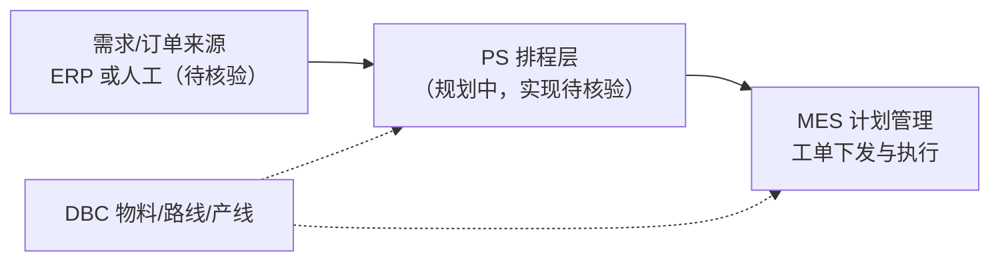

# PS 排程管理

> 适用基线：测试环境目标 / `dev` 分支 / 2026-07-15。  
> 阅读对象：**测试、实施（主）**；计划员、生产主管（顺带）。  
> **侧栏标注「规划中」。本模块文档边界 = 规划意图 + 与 MES/DBC 的边界说明；不是已交付功能说明书。**

!!! warning "规划中 / 待取证 — 售前与验收必读"
    - **不要**对外宣称本仓库已证实具备完整 APS/排程引擎、甘特发布或与 MES 自动挂接。  
    - **已落地**的「ERP 订单 → 生产订单 → 工单 → 下发/开工」请读 [MES 计划管理](../06-MES-生产管理/03-计划管理/index.md)。  
    - 下列分组名来自站点导航骨架；**分组名 ≠ 已落地菜单或后端对象**（见下方盘点结论）。  
    - 旧稿字段表、算法指标、ER、策略枚举均为**未取证**，禁止当作培训/验收事实。

## 模块解决什么问题（产品意图）

排程管理（Production Scheduling，PS）在产品规划中，面向生产计划员，承接「需求/订单 → 产能约束下的可执行计划 → 下发生产」之间的**排程层**能力：维护约束主数据、维护待排订单、执行排程、对比版本、查询结果，并以计划视图支撑发布决策。

它与 MES 计划管理**不是同一层**：

| 层级 | 负责什么 | 当前文档入口 | 资料状态 |
| --- | --- | --- | --- |
| PS（规划） | 多约束排产 / 版本对比与计划输出 | 本页及站点分组骨架 | **规划中 / 待取证** |
| MES 计划管理 | ERP 订单 → 生产订单 → 工单 → 下发/开工 | [计划管理](../06-MES-生产管理/03-计划管理/index.md) | **已落地（以 MES 页为准）** |
| DBC 工艺/工厂 | 工艺路线、车间/产线等 | [工艺路线](../04-DBC-主数据管理/08-工艺建模/02-工艺路线.md)、[生产线](../04-DBC-主数据管理/04-工厂建模/07-生产线管理.md) | **已落地** |

## 功能范围（当前可写 vs 禁止断言）

| 当前可写（本页承诺） | 禁止写成已交付 |
| --- | --- |
| 产品意图、与 MES/DBC 边界、常见误解纠偏 | 菜单路由、后端模块、表结构、字段、状态机 |
| 站点导航分组骨架及各分组「规划意图」 | 算法参数、利用率公式、冲产能等策略枚举 |
| 指向 MES/DBC 的已证实相邻能力 | 「PS 已与 MES/ERP 自动挂接」类结论 |
| `GAP-017` 及待取证清单提示 | 用旧稿字段表做实施验收清单 |

## 测试与实施从哪读

| 你的目的 | 建议阅读 |
| --- | --- |
| 判断 PS 能否按「完整排程产品」验收/对外介绍 | **本页警告框 + 盘点结论**（答案：现阶段不能） |
| 已落地计划/下发/开工怎么测、怎么配 | [MES 计划管理](../06-MES-生产管理/03-计划管理/index.md) 及其叶页/维护参考 |
| 工艺/产线等排程可能引用的主数据 | DBC 工艺建模、工厂建模对应页 |
| 站点上 PS 分组页在写什么 | 下表分组（仅规划意图；**无**字段级维护参考可依赖） |
| 售前 5～10 分钟 | 只讲「规划中排程层意图 + 已落地在 MES」；**禁止**演示未取证字段/指标 |

## 配置依赖概览

| 依赖 | 当前口径 |
| --- | --- |
| MES 计划管理 | 实施与测试的**真实配置/验证主战场**；勿把 MES 规则抄进 PS |
| DBC 物料/BOM/路线/产线 | 规划中排程输入可能引用；维护细则在 DBC，**映射未证实** |
| ERP / 外部排程引擎 | 订单同步、结果回传均**待核验**；不得臆造接口路径 |
| PS 自身菜单/参数/引擎 | **未在本仓库证实**；无独立配置页可按「已上线」验收 |

## 当前可确认状态（盘点结论）

| 检查项 | 结论 |
| --- | --- |
| `docs/11-PS-排程管理/` 导航结构 | **有**：模块首页 + 6 个分组页（与导航一致） |
| `reference/menu.csv` | **未检出**含「排程 / PS / APS / 产能表 / 产品序列 / 物料节拍」等菜单项 |
| 后端独立排程业务模块 | **无**（现有 `schedule` 命中多为无关定时/日程对象） |
| 前端 `ps` 视图目录 | **无** |
| 内部逐对象资料 | **无**；见 `GAP-017` |
| 旧版字段表 / ER / 指标公式 | **未取证**，不得继续当作事实 |

**因此本轮只能做到：** 保留导航与分组骨架，写清意图与边界，显式「规划中/待取证」；**暂不展开**字段级维护细节。

## 业务分组（规划意图，非实现断言）

| 分组 | 规划意图 | 当前可写范围 |
| --- | --- | --- |
| [01-基础数据](01-基础数据.md) | 产能、序列、节拍、排程场景等约束 | 只写期望作用与缺口 |
| [02-维护订单](02-维护订单.md) | 排程输入侧订单/需求 | 只写与 MES 订单边界，不抄 MES 字段 |
| [03-执行生产排程](03-执行生产排程.md) | 按场景/版本触发排程 | 不写未证实算法参数 |
| [04-排程结果对比](04-排程结果对比.md) | 多版本指标对比与择优 | 不写未证实指标与阈值 |
| [05-查询排程结果](05-查询排程结果.md) | 按版本/日期查明细 | 不写未证实明细字段 |
| [06-生产计划查询](06-生产计划查询.md) | 计划可视化与发布后查询 | 不写未证实交互与发布规则 |

## 期望协同关系（示意）

箭头方向、触发时机、幂等与失败补偿均属 **未证实**（`GAP-017`）。

## 与相关模块的边界

| 协同方 | PS 侧期望职责 | 不在本模块展开 / 勿混写 |
| --- | --- | --- |
| [MES 计划管理](../06-MES-生产管理/03-计划管理/index.md) | 排程结果如何进入可下发工单（待核验） | 已证实的工单下发/开工规则 |
| [DBC 工艺路线](../04-DBC-主数据管理/08-工艺建模/02-工艺路线.md) | 可能引用路线/序列（待核验） | 路线维护细则 |
| [DBC 生产线](../04-DBC-主数据管理/04-工厂建模/07-生产线管理.md) / [车间](../04-DBC-主数据管理/04-工厂建模/06-车间管理.md) | 产能与产线定位（待核验） | 工厂建模主维护 |
| [DBC 物料](../04-DBC-主数据管理/01-物料管理/01-物料基本信息.md) / [BOM](../04-DBC-主数据管理/01-物料管理/02-BOM.md) | 物料与 BOM 作为输入（待核验） | 物料/BOM 主维护 |
| ERP / 外部引擎 | 同步与回传（待核验） | 臆造接口与报文 |
| [API 参考](../14-API参考/index.md) | 排程相关接口登记入口（仍可能为占位） | — |

## 常见误解

| 误解 | 正确口径 |
| --- | --- |
| 「文档有字段表 = 系统已有功能」 | 字段表来自历史占位，**未与源码/菜单对齐** |
| 「MES 计划管理就是 PS」 | MES 管工单生命周期；PS 是规划中排程层 |
| 「可把 MES 工单字段抄到维护订单页」 | **禁止**；取证后再写映射 |
| 「可对外按完整 APS 售卖本模块」 | **禁止**；对外只可说规划中，落地能力指 MES |

## 版本历史

| 版本 | 日期 | 说明 |
| --- | --- | --- |
| V1.3 | 2026-07-23 | W2 模块地图：显式规划中/待取证、测试实施阅读路径与配置依赖 |
| V1.2 | 2026-07-17 | 盘点后薄弱资料口径；去掉未取证字段/ER/公式 |
| V1.1 | 2026-05-21 | 拆分为多页面结构（历史占位） |
| V1.0 | 2026-05-20 | 初版占位 |
