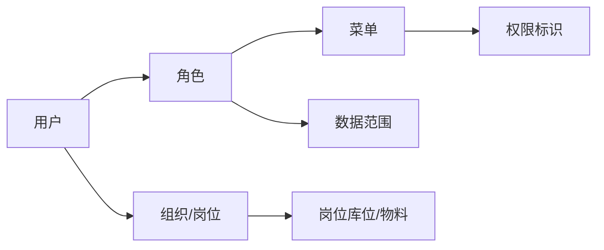

# 用户与权限

> 适用基线：测试环境目标 / `dev` 分支 / 2026-07-15。  
> 阅读对象：**测试、实施（主）**；系统管理员、安全协同、业务管理员（顺带）。售前只了解「功能授权 ≠ 数据范围 ≠ 岗位」三层即可。

## 这一组解决什么问题

用户与权限回答三件彼此相关、但不能混为一谈的事：

1. **功能授权（RBAC）**：谁能看到哪些菜单、页面和操作入口。  
2. **数据权限**：在已有功能入口内，能看到或操作哪些数据范围。  
3. **岗位与审批主体**：任务由谁承接、现场区域如何约束，以及审批与功能授权如何配合。

本分组提供跨模块的授权底座说明。WMS、MES、QMS 等业务页仍要写清各自动作的状态条件、数据影响和审计要求，不能只写“有某某权限码”。

## 功能范围

| 本分组覆盖 | 不在本分组 |
| --- | --- |
| 用户—角色—菜单—权限标识；角色数据范围；岗位库位/物料与审批边界 | 各业务状态机「某状态能否点按钮」细则（回业务页） |
| 授权排查顺序 | 全站逐页 RBAC 实测矩阵（`GAP-014` 未齐） |

## 测试与实施从哪读

| 你的目的 | 建议阅读 |
| --- | --- |
| 建立授权三层概念与学习顺序 | **本页** |
| 配角色菜单/权限标识 | [RBAC 权限模型](01-RBAC权限模型.md) + [维护参考](RBAC权限模型-维护与查询参考.md) |
| 配部门/本人等数据范围 | [数据权限与决策权限](02-数据权限与决策权限.md) + [维护参考](数据权限与决策权限-维护与查询参考.md) |
| 配岗位库位与任务承接 | [岗位、任务分配与审批主体](03-岗位、任务分配与审批主体.md) + [维护参考](岗位、任务分配与审批主体-维护与查询参考.md) |
| 售前 | 三层分工一句话；勿进维护参考 |

## 配置依赖概览

| 依赖 | 影响 |
| --- | --- |
| 租户套餐菜单上限 | 角色再授权也超不过套餐 |
| 用户部门归属 | 部门类数据范围 |
| 业务是否挂接部门数据权限 | 「有菜单但无数据」排查（`GAP-070`） |
| 岗位区域权限 | 库位现场任务可见性 |

## 建议学习与操作顺序

| 顺序 | 建议先看什么 | 为什么 |
| --- | --- | --- |
| 1 | [RBAC 权限模型](01-RBAC权限模型.md) | 先建立用户—角色—菜单—权限标识主链 |
| 2 | [RBAC权限模型-维护与查询参考](RBAC权限模型-维护与查询参考.md) | 日常维护与排错顺序 |
| 3 | [数据权限与决策权限](02-数据权限与决策权限.md) | 区分“能进功能”和“能看数据” |
| 4 | [数据权限与决策权限-维护与查询参考](数据权限与决策权限-维护与查询参考.md) | 配置角色数据范围与验收 |
| 5 | [岗位、任务分配与审批主体](03-岗位、任务分配与审批主体.md) | 岗位库位/物料与现场任务边界 |
| 6 | [岗位、任务分配与审批主体-维护与查询参考](岗位、任务分配与审批主体-维护与查询参考.md) | 岗位日常维护与联查 |

## 关键对象关系

## 分页说明

| 页面 | 说明 | 本阶段状态 |
| --- | --- | --- |
| RBAC 权限模型 | 功能授权主链、超管、菜单/按钮/接口分层 | 已业务化；含维护与查询参考 |
| 数据权限与决策权限 | 角色部门/本人五档、与岗位库位边界 | 已业务化；含维护与查询参考 |
| 岗位、任务分配与审批主体 | 岗位主数据、WMS 消费与审批引擎边界 | 已业务化；含维护与查询参考 |

## 常见问题（分组级）

| 情况 | 建议处理 |
| --- | --- |
| 用户说“没权限” | 先分清是看不见菜单、看不见按钮，还是执行时报错 |
| 想靠加菜单解决数据隔离 | 回到数据权限页；并确认目标业务是否接入部门范围 |
| 库位现场看不见任务 | 查岗位区域权限，不要只改角色数据范围 |
| 业务动作在某状态不能做 | 回对应业务页查状态规则，不要只改角色 |

## 当前限制与待确认事项

- 全站逐页 RBAC 实测矩阵尚未建立（`GAP-014`）  
- 各业务模块部门数据权限挂接清单未齐（`GAP-070`）  
- 岗位在各业务页的消费细则与审批启用范围待随业务续作  
- 前端显隐与后端强制鉴权不一致的接口清单需持续登记  
