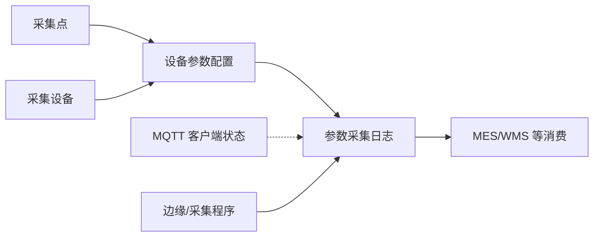

# 数采管理

> 适用基线：测试环境目标 / `dev` 分支 / 2026-07-15。  
> 阅读对象：**测试、实施（主）**；设备/自动化工程师、运维（顺带）。售前只读「模块解决什么问题」；操作细节进分组维护参考。

## 模块解决什么问题

数采管理面向现场设备参数的**接入配置、采集记录与链路监控**：维护采集点（目标地址/协议线索）、采集侧设备与参数项、查询参数采集日志，并监控 MQTT 客户端在线状态。前端菜单根路径为 `/iot`；管理端经 IoT 网关服务提供能力（完整网关后端不在本仓库）。

本模块**不是** DBC 设备台账、EAM 维修工单、ANDON 呼叫、WMS/AGV 搬运任务的替代页。MES/WMS 可通过网关查询或下发参数（如点检读数），属消费侧。

## 功能范围

| 在本模块 | 不在本模块（去哪看） |
| --- | --- |
| 采集点、设备参数配置 | DBC 设备/工装身份台账 |
| 采集侧设备主档、采集日志、MQTT 监控 | EAM 报修维修 / ANDON 呼叫 |
| 接入分层与跨模块边界说明 | WMS 库存事务、AGV 搬运任务 |
| Node-RED 相关菜单意图（资料薄弱） | 把 Node-RED 写成完整运维台（见该页薄弱说明） |

## 测试与实施从哪读

| 你的目的 | 建议阅读 |
| --- | --- |
| 模块边界、维护顺序、配置依赖 | **本页** |
| 采集如何分层、谁消费读数 | [数采与边缘接入模型](04-数采与边缘接入模型.md) |
| 配采集点 / 参数项 | [采集点](01-采集点/index.md) + 其维护参考 |
| 建采集设备、查日志、看 MQTT | [设备管理](02-设备管理/index.md) + 其维护参考 |
| Node-RED 入口现状 | [NodeRed](03-NodeRed.md)（薄弱；验证前先读边界） |
| 联调对外接口 | [API 模块索引](../14-API参考/02-模块接口索引.md) |
| 售前介绍 | 仅「解决什么问题」+「不是台账/维修替代」；勿承诺未证实同步 |

## 配置依赖概览

| 依赖层 | 先备 / 改什么 | 行为影响 |
| --- | --- | --- |
| 采集点 | 目标 IP/端口/地址、目标类型 | 读参失败、边缘无法识别 |
| 采集设备 | 编码、类别、启用 | 未启用则无有效采集主体 |
| 设备参数配置 | 是否采集、分区编码对齐采集点 | 日志长期为空的最常见原因 |
| 字典 | 目标类型、参数类型、读写方式、在线状态等 | 下拉与筛选口径 |
| 边缘 / MQTT 客户端 | 上报约定、客户端 ID | Web 配好但无上报 → 日志空 |
| 与 DBC 台账编码 | 是否约定一致 | 跨模块对不上号（**强制同步未证实**） |
| 权限 | 导出与维护权限 | 无入口或无法导出 |

建议验收顺序：建采集点 → 建并启用设备 → 配参数并打开采集 → 边缘上报 → 日志与 MQTT 监控可查。

## 业务分组

| 分组 | 说明 | 菜单入口（已证实） |
| --- | --- | --- |
| [01-采集点](01-采集点/index.md) | 采集点信息；设备参数配置 | 采集点管理、设备参数配置 |
| [02-设备管理](02-设备管理/index.md) | 采集侧设备、采集日志、MQTT 监控 | 设备管理、采集日志、MQTT客户端监控 |
| [03-NodeRed](03-NodeRed.md) | Node-RED 管理/日志导航意图 | 页面实现薄弱 |
| [04-数采与边缘接入模型](04-数采与边缘接入模型.md) | 职责分层与跨模块边界 | — |

## 与 DBC / MES / WMS / AGV / EAM 边界

| 协同方 | 本模块负责 | 不在本模块展开 |
| --- | --- | --- |
| DBC 设备/工装台账 | 编码可对齐引用（未证实强制同步） | 台账身份、归属车间产线 |
| MES | 点检等可通过网关读参/发消息 | 工单、报工、线边终端 |
| WMS | 部分作业可查询 IoT 数据 | 库存事务、PDA 任务 |
| AGV | 点位主数据在 DBC；任务回调在 AGV 服务 | 潜伏式点位配置、搬运任务 |
| EAM / ANDON | — | 故障与呼叫业务；采集原始时序本身 |

## 文末未决

- IoT 网关后端不在本仓库；字段以 Web 表单/API 与字典为准（`GAP-072`）。  
- 数采设备与 DBC 台账是否双向同步：**未证实**。  
- Node-RED：菜单有、页面实现薄弱。  
- 边缘协议细节、断线补传、保留策略：待现场与网关服务核验。
