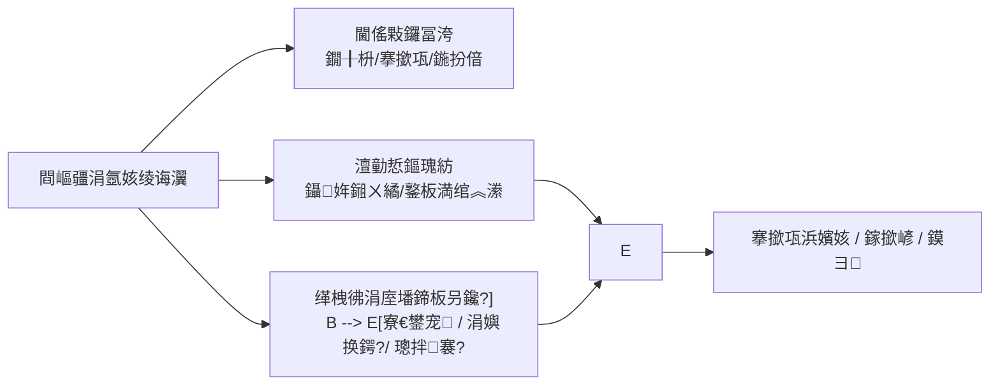

# 涓氬姟绫诲瀷

> 閫傜敤鍩虹嚎锛氭祴璇曠幆澧?/ `dev` 鍒嗘敮 / 2026-07-15銆?> 鍏变韩鍒嗘祦璇箟瑙乕鍗曟嵁绫诲瀷銆佷笟鍔＄被鍨嬩笌鍗曟嵁閰嶇疆](../../02-涓氬姟妯″瀷/05-鍗曟嵁绫诲瀷銆佷笟鍔＄被鍨嬩笌鍗曟嵁閰嶇疆.md)銆?
鏈〉鍥炵瓟锛氫笟鍔＄被鍨嬬鍝簺琛屼负杈圭晫锛涙敼鍝竴绫婚厤缃細鏀瑰彉涓嬫父鍗曟嵁銆佺幇鍦烘搷浣溿€佸簱瀛樹簨鍔℃垨鎵撳嵃銆傝瀹屽簲鑳藉湪娴嬭瘯鐜鎸夈€屾敼閰嶇疆 鈫?寮€涓€绗斾笟鍔?鈫?瀵圭収缁撴灉銆嶅仛楠岃瘉锛岃€屼笉鏄彧璁颁綇瀛楁娓呭崟銆?
## 濡備綍浣跨敤鏈粍鏂囨。

| 浣犺鍋氫粈涔?| 璇诲摢閲?|
| --- | --- |
| 鐞嗚В涓氬姟绫诲瀷瑙ｅ喅浠€涔堥棶棰樸€佹敼閰嶇疆褰卞搷浠€涔堛€佹€庝箞楠?| **鏈〉锛堜富鏂囨。锛?* |
| 鏌ュ畬鏁村瓧娈佃涔夈€侀厤缃垎缁勩€佸彇鍊煎奖鍝嶇煩闃点€佸彉鏇村墠妫€鏌ユ竻鍗?| [涓氬姟绫诲瀷-缁存姢涓庢煡璇㈠弬鑰僝(09-涓氬姟绫诲瀷-缁存姢涓庢煡璇㈠弬鑰?md) |
| 瀵圭収銆屼笟鍔＄被鍨?/ 鍗曟嵁璁剧疆 / 寮€鍏?/ 瑙勫垯銆嶈皝绠′粈涔?| [鍗曟嵁绫诲瀷銆佷笟鍔＄被鍨嬩笌鍗曟嵁閰嶇疆](../../02-涓氬姟妯″瀷/05-鍗曟嵁绫诲瀷銆佷笟鍔＄被鍨嬩笌鍗曟嵁閰嶇疆.md) |
| 鐪嬬幇鍦轰笟鍔″浣曟秷璐规湰绛栫暐锛堢ず渚嬶級 | [閲囪喘鏀惰揣](../../../05-WMS-搴撴埧绠＄悊/03-閲囪喘鏀惰揣/index.md) |

涓氬姟绫诲瀷鏄?*楂橀闄╃瓥鐣?*锛氫竴娆″彉鏇村彲鑳藉悓鏃跺奖鍝嶅崟鎹垱寤恒€佺粓绔搷浣溿€佸簱瀛樹簨鍔″拰鎵撳嵃銆傚簲鎸夊彈鎺у彉鏇村鐞嗭紝涓嶈褰撴垚鏅€氬垎绫诲瓧鍏搞€?
## 杩欓」閰嶇疆瑙ｅ喅浠€涔堥棶棰?
鐢宠銆佷换鍔°€佽褰曠瓑涓氬姟瀵硅薄闇€瑕佷竴濂?*鍏卞悓鐨勫満鏅垎绫诲彛寰?*銆備笟鍔＄被鍨嬫妸銆岃繖绫讳笟鍔¤兘閫変粈涔堛€佹€庝箞璧版祦绋嬨€佸簱瀛樻€庝箞鍔ㄣ€佸崟鍙峰拰鏍囩浠庡摢鏉ャ€嶆敹鏁涙垚涓€鏉″彲缁存姢鐨勭瓥鐣ワ紝閬垮厤姣忎釜涓氬姟椤靛悇鑷‖缂栫爜銆?
瀹?*涓?*鏇夸唬锛?
- [鍗曟嵁璁剧疆](04-鍗曟嵁璁剧疆.md)锛氬彧绠＄紪鍙风粍鎴愯鍒欙紱
- 鍗曟嵁寮€鍏炽€佽鍒欑鐞嗭細鍚勬湁鐙珛浣滅敤闈紙瑙佸叡浜€氫緥椤碉級銆?
## 涓€绗斿吀鍨嬮厤缃笟鍔?
**鍦烘櫙锛?* 涓恒€岄噰璐敹璐с€嶅噯澶囦竴鏉″彲鐢ㄧ殑涓氬姟绫诲瀷锛屼娇鐜板満鑳介€夊搴撲綅鑼冨洿銆佹寜绾﹀畾鑷姩鎺ㄨ繘锛屽苟鎸備笂姝ｇ‘鐨勭紪鍙?鎵撳嵃鍏宠仈銆?
1. **瑙﹀彂**锛氬疄鏂界‘璁ょ洰鏍囧満鏅紙濡傞噰璐敹璐э級銆佸叆鍑哄簱鏂瑰悜銆佹槸鍚﹀厑璁告敼閲?鏀瑰簱浣嶃€佹槸鍚﹁嚜鍔ㄦ彁浜?鍚屾剰/鎵ц銆佺紪鍙蜂笌鎵撳嵃闇€姹傘€?2. **澶勭悊**锛氬湪涓氬姟绫诲瀷涓淮鎶ゅ熀鏈瘑鍒€侀€傜敤鑼冨洿銆佸簱瀛樹笌鍦ㄩ€斻€佽嚜鍔ㄥ寲銆佺幇鍦虹害鏉熴€佺紪鍙蜂笌鎵撳嵃鍏宠仈锛屽苟缃负鍙敤銆?3. **缁撴灉**锛氱洰鏍囦笟鍔″紑鍗曟椂鍙紩鐢ㄨ绫诲瀷锛涚幇鍦哄彲閫夎寖鍥翠笌鑷姩鎺ㄨ繘璺緞鎸夐厤缃敹绱ф垨鏀惧锛涙柊鍗曞彿/鏍囩鎸夊叧鑱旇鍒欒蛋銆?4. **鍏抽敭鍒嗘敮**锛?   - 鑼冨洿閰嶅緱杩囩獎 鈫?鐜板満閫変笉鍒颁粨搴?搴撳尯/搴撲綅鎴栫墿鏂欙紱
   - 鑷姩澶勭悊璇紑 鈫?鐢宠鍙兘璺宠繃浜哄伐瀹℃牳鑺傜偣鐩存帴杩涘叆浠诲姟/璁板綍锛堢湡瀹炵姸鎬佽縼绉荤粏鑺?鉂擄紝瑙佹枃鏈級锛?   - 鍏ュ嚭鏂瑰悜鎴栧湪閫旈厤閿?鈫?搴撳瓨澧炲噺鎴栧湪閫斿湴鐐逛笌瀹炲姟鐩稿弽锛?   - 妯℃澘/鍙锋閿欐寕 鈫?閿欏彿鎴栭敊鎵撱€?

!!! example "鍐欏疄绀轰緥锛堢粰瀹氶厤缃?鈫?鏈熸湜琛屼负锛?
    **缁欏畾锛?* 閲囪喘鏀惰揣涓氬姟绫诲瀷鍏佽鏀规暟閲忋€佺姝㈡敼搴撲綅锛涙湭寮€鑷姩鎻愪氦锛涘叆鍑虹敤閫斾笌鏀惰揣鍏ュ簱浜嬪姟鍙ｅ緞涓€鑷达紱宸插叧鑱旂敵璇?浠诲姟鍙锋銆?    **鏈熸湜锛?* 寤烘敹璐х敵璇峰彲閫夎绫诲瀷锛涙彁浜ゅ悗浠嶉渶浜哄伐瀹℃牳鑺傜偣锛涗换鍔℃墽琛屾椂鏁伴噺鍙敼銆佸簱浣嶄笉鍙敼锛涙柊鍗曞彿鎸夊叧鑱斿彿娈电敓鎴愩€?    **瀵圭収锛?* 鑻ヤ换鍔′笂搴撲綅浠嶅彲鏀癸紝鎴栨湭鎻愪氦鍗崇敓鎴愪换鍔★紝鍏堟煡鏈被鍨嬬幇鍦虹害鏉熶笌鑷姩澶勭悊锛屽啀鏌ュ崟鎹紑鍏?瑙勫垯锛屽嬁鍙敼涓氬姟椤点€?
## 浣跨敤鍓嶅噯澶?
1. 鐩爣涓氬姟鍦烘櫙涓庡崟鎹璞★紙鐢宠 / 浠诲姟 / 璁板綍锛夊凡鏄庣‘銆?2. 鍏ュ嚭搴撴柟鍚戙€佷簨鍔″彛寰勩€佹槸鍚︿娇鐢ㄥ湪閫斿強鍦ㄩ€斿湴鐐瑰凡鐢变笟鍔¤礋璐ｄ汉鎵瑰噯銆?3. 鍙敤鐗╂枡/璐ㄩ噺鐘舵€併€佷粨搴?搴撳尯鑼冨洿涓庣幇鍦?SOP锛堣兘鍚︽敼閲忋€佹敼浣嶃€佽秴鏀?娆犳敹銆侀噸澶嶆壂鎻忕瓑锛夊凡瀵归綈銆?4. 鑻ラ渶缂栧彿鎴栨墦鍗帮細鐩稿叧[鍗曟嵁璁剧疆](04-鍗曟嵁璁剧疆.md)涓庢墦鍗版ā鏉挎潵婧愬凡鍑嗗锛堟墦鍗版ā鏉垮叆鍙ｅ綋鍓嶅彲鑳戒粛璧?WMS 鏍囩锛屼骇鍝佺洰鏍囧綊灞?INFRA锛夈€?5. 鍙樻洿鍦?*娴嬭瘯鐜**鐢ㄥ畬鏁撮摼璺獙璇佸悗鍐嶈繘鐢熶骇銆?
## 涓氬姟閫昏緫瑕佺偣

| 瑕佺偣 | 璇存槑 |
| --- | --- |
| 涓诲璞?| 涓氬姟绫诲瀷鏄瓥鐣ユ。妗堬紝琚崟鎹缃€佸紑鍏炽€佽鍒欏強鍚勭被涓氬姟椤靛紩鐢ㄣ€?|
| 褰卞搷鏂瑰悜 | 閰嶇疆 鈫?寮€鍗曞彲閫夌被鍨嬩笌鑼冨洿 鈫?鐢宠/浠诲姟/璁板綍鎺ㄨ繘鏂瑰紡 鈫?搴撳瓨涓庢墦鍗扮粨鏋溿€?|
| 涓庣幇鍦轰换鍔?| 浠诲姟鎺у埗绫诲紑鍏筹紙鏀归噺銆佹敼搴撲綅銆佽繛缁壂鎻忋€侀儴鍒嗗畬鎴愮瓑锛変細琚敹璐х瓑鐜板満浠诲姟璇诲彇锛涘厛鏌ョ被鍨嬶紝鍐嶆煡鍏蜂綋涓氬姟椤点€?|
| 涓庣紪鍙?| 绫诲瀷涓婂彲鍏宠仈鍙锋/鎵撳嵃锛涘疄闄呭崟鍙风粍鎴愪粛浠鍗曟嵁璁剧疆](04-鍗曟嵁璁剧疆.md)涓哄噯銆?|
| 鐢熸晥杈圭晫 | **鏈瘉瀹?*姣忎釜瀛楁閮借姣忎釜 WMS/MES 椤甸潰瀹屾暣娑堣垂锛涘繀椤绘寜鐩爣涓氬姟閫愰」楠岃瘉锛坄FSEM-005`锛夈€?|

## 閰嶇疆濡備綍璧蜂綔鐢?
鏀归厤缃椂鎸夈€屾敼浠€涔?鈫?涓嬫父鍝噷鍙樸€嶇悊瑙ｃ€備笅琛ㄥ彧鍐欏凡鏈夋枃妗?閾捐矾鍙敮鎾戠殑缁撹锛涙湭闂悎椤规爣 鉂撱€?
| 浣犳敼浜嗕粈涔?| 涓嬫父閫氬父浼氬彂鐢熶粈涔?| 璇佸疄绋嬪害 |
| --- | --- | --- |
| 鏀剁揣/鏀惧浠撳簱銆佸簱鍖恒€佸湴鐐规垨鐗╂枡/璐ㄩ噺閫傜敤鑼冨洿 | 鏂板紑浠诲姟鎴栫幇鍦洪€夋嫨鍣ㄥ彲閫夎寖鍥村彉灏忔垨鍙樺ぇ | 閰嶇疆椤瑰瓨鍦紱鍚勬秷璐规柟鏄惁瀹屾暣璇诲彇 鉂?|
| 鍏ュ嚭搴撶敤閫斻€佷簨鍔℃柟鍚戙€佸湪閫斿簱/鍦ㄩ€斿簱浣?| 搴撳瓨浜嬪姟涓庡湪閫旇矾寰勬寜鏂板彛寰勮蛋 | 涓庝簨鍔＄被鍨嬪崗鍚岀殑閰嶇疆瀛樺湪锛涗簰鏂?寮烘牎楠?鉂?|
| 鑷姩鎻愪氦 / 鑷姩鍚屾剰 / 鑷姩鎵ц / 鐩存帴鐢熸垚璁板綍 | 鐢宠鈫掍换鍔♀啋璁板綍浜哄伐鑺傜偣鍑忓皯鎴栬烦杩?| 寮€鍏冲瓨鍦ㄤ簬閰嶇疆锛涚湡瀹炲鎵逛富浣撲笌鐘舵€佺爜 鉂擄紙`GAP-002`锛?|
| 绂佹鎴栧厑璁告敼搴撲綅銆佹暟閲忋€佹壒娆°€佸寘瑁咃紱瓒呮敹/娆犳敹銆侀噸澶嶆壂鎻忋€佺洰鏍囧簱浣嶆壂鎻?| PDA/Web 鎵ц鏃跺搴斿瓧娈靛彲鍚︽敼銆佹壂鎻忕粏鍒欐澗绱у彉鍖?| 鏀惰揣绛変换鍔″凡璇诲彇浠诲姟鎺у埗绫婚厤缃紱缁嗗垯缁勫悎 鉂?|
| 鐢宠/浠诲姟/璁板綍鍙锋鍚敤鍙婃墦鍗版ā鏉跨粦瀹?| 鏂板崟鎹彇鍙蜂笌鏍囩妯℃澘鏉ユ簮鍙樺寲锛涙棫鍗曢€氬父浠嶄繚鐣欏師鍙?| 鍏宠仈鑳藉姏瀛樺湪锛涙ā鏉垮け鏁堜繚鎶?鉂擄紙`GAP-060`锛?|
| 鍋滅敤锛堟槸鍚﹀彲鐢?= 鍚︼級 | 鏂颁笟鍔′笉搴斿啀閫夌敤璇ョ被鍨?| 鍋滅敤鍚庡湪閫旀棫鍗曡兘鍚︾户缁紩鐢?鉂?|

**瀹炴柦鍙ｈ瘈锛?* 鍏堝畾鍦烘櫙涓庡簱瀛樺彛寰勶紝鍐嶅畾鑷姩涓庣幇鍦虹害鏉燂紝鏈€鍚庢寕鍙锋/妯℃澘锛涗换浣曚竴椤瑰彉鏇撮兘鐢ㄧ洰鏍囦笟鍔″紑涓€鍗曢獙璇侊紝涓嶈鍋囪銆岄厤浜嗗氨鍏ㄧ珯鐢熸晥銆嶃€?
## 寤鸿楠岃瘉鐐?
1. **鑼冨洿**锛氭敹绱у簱鍖哄悗锛岀洰鏍囦笟鍔℃柊寤轰换鍔℃椂鏄惁閫変笉鍒拌鎺掗櫎搴撳尯锛涙斁瀹藉悗鏄惁鍙€夊洖鏉ワ紙鍚槸鍚﹀嵆鏃剁敓鏁?鉂擄級銆?2. **鑷姩澶勭悊**锛氫粎寮€銆岃嚜鍔ㄦ彁浜ゃ€嶄笌鍚屾椂寮€銆岃嚜鍔ㄦ彁浜?鑷姩鍚屾剰銆嶅悇璧颁竴绗旓紝瀵圭収鏄惁灏戜簡浜哄伐鑺傜偣锛堜笉鎵胯鍥哄畾鐘舵€佺爜锛夈€?3. **鐜板満绾︽潫**锛氱姝㈡敼搴撲綅鍚庯紝鏀惰揣浠诲姟鎵ц椤靛簱浣嶆槸鍚︿笉鍙敼锛涘厑璁告敼鏁伴噺鍚庢暟閲忔槸鍚﹀彲鏀广€?4. **搴撳瓨鏂瑰悜**锛氬叆鍑虹敤閫斾笌瀹炲姟涓€鑷寸殑涓€绗斿畬鎴愬悗锛屽簱瀛樺鍑忔柟鍚戞槸鍚︽纭紱鍦ㄩ€斿紑鍚椂鍦ㄩ€斿湴鐐规槸鍚︾鍚堥鏈熴€?5. **缂栧彿/鎵撳嵃**锛氬叧鑱斿彿娈典笌妯℃澘鍚庯紝鏂扮敵璇?浠诲姟鍙峰強鎵撳嵃鏄惁鏉ヨ嚜棰勬湡瑙勫垯锛涙晠鎰忛敊鎸傛ā鏉挎椂鏄惁澶辫触鎴栨墦閿欍€?6. **鍋滅敤**锛氬仠鐢ㄥ悗鏂板崟閫夋嫨鍣ㄦ槸鍚︿粛鍑虹幇璇ョ被鍨嬶紱宸叉湁鍦ㄩ€斿崟琛屼负鍗曠嫭璁板綍锛堝嬁榛樿涓庢柊寤虹浉鍚岋級銆?7. **鍥炲綊**锛氬彉鏇村悗鑷冲皯瑕嗙洊鍒涘缓 鈫?瀹℃壒/鎵ц 鈫?搴撳瓨缁撴灉 鈫?鎾ら攢锛堣嫢涓氬姟鏀寔锛夆啋 鎵撳嵃/寮傚父鍚勪竴娆°€?
瀹屾暣妫€鏌ラ」瑙乕缁存姢涓庢煡璇㈠弬鑰僝(09-涓氬姟绫诲瀷-缁存姢涓庢煡璇㈠弬鑰?md)銆?
## 鍏抽敭瀛楁涓氬姟瑙掕壊

| 瀛楁/閰嶇疆鐐?| 鍦ㄧ郴缁熶腑鐨勪綔鐢?| 閰嶉敊鎴栨敼閿欐椂瑕佽鎯曚粈涔?|
| --- | --- | --- |
| 涓氬姟绫诲瀷浠ｇ爜/鍚嶇О | 绛栫暐韬唤锛涜鍗曟嵁涓庨厤缃紩鐢?| 琚紩鐢ㄥ悗鏀圭爜/鍒犻櫎淇濇姢 鉂擄紙`GAP-060`锛?|
| 閫傜敤鑼冨洿锛堢墿鏂?搴撳瓨/鍦扮偣绛夛級 | 闄愬埗鍙€夊璞?| 杩囩獎閫変笉鍒帮紱杩囧閫夊埌涓嶈閫夌殑 |
| 鍏ュ嚭搴?/ 鍦ㄩ€斿鐞?| 搴撳瓨浜嬪姟鏂瑰悜涓庡湪閫斿湴鐐?| 鏂瑰悜鍙嶄簡浼氬鑷村簱瀛樺鍑忛敊璇?|
| 鑷姩鎻愪氦 / 鑷姩鍚屾剰 / 鑷姩澶勭悊绛?| 鏀瑰彉鐢宠鈫掍换鍔♀啋璁板綍鎺ㄨ繘璺緞 | 璇紑鍙兘瀵艰嚧鏈鍗虫墽琛?|
| 浠诲姟鎺у埗绫诲紑鍏?| 鐜板満鑳藉惁鏀归噺銆佹敼搴撲綅銆佽繛缁壂鎻忕瓑 | 涓?SOP 涓嶄竴鑷翠細閫犳垚鎵爜澶辫触鎴栬繚瑙勫畬鎴?|
| 缂栧彿 / 鎵撳嵃妯℃澘鍏宠仈 | 鍗曞彿瑙勫垯涓庢爣绛炬ā鏉挎潵婧?| 閿欐寕瀵艰嚧閿欏彿/閿欐墦 |
| 鏄惁鍙敤 | 鏂颁笟鍔¤兘鍚﹀紩鐢?| 鍋滅敤鍚庢棫鍗曡涓?鉂?|

瀹屾暣璇箟銆侀厤缃垎缁勪笌鍙栧€煎奖鍝嶇煩闃佃[缁存姢涓庢煡璇㈠弬鑰僝(09-涓氬姟绫诲瀷-缁存姢涓庢煡璇㈠弬鑰?md)銆?
## 鍋氬畬褰卞搷浠€涔?
- **涓嬫父涓氬姟椤?*锛氬紑鍗曞彲閫夌被鍨嬨€佽嚜鍔ㄦ帹杩涜矾寰勩€佺幇鍦哄彲鏀硅寖鍥村彲鑳藉彉鍖栥€?- **搴撳瓨**锛氬叆鍑烘柟鍚戜笌鍦ㄩ€斿彛寰勫彉鍖栦細鏀瑰彉浜嬪姟涓庨鏈熷簱瀛樿〃鐜般€?- **缂栧彿涓庢墦鍗?*锛氭柊鍗曟寜鏂板叧鑱斿彇鍙?鎵撴爣锛涘凡鐢熸垚鍗曟嵁閫氬父淇濈暀鍘熷彿銆?- **鍏跺畠绛栫暐**锛歔鍗曟嵁璁剧疆](04-鍗曟嵁璁剧疆.md)銆佸崟鎹紑鍏炽€佽鍒欑鐞嗕粛鍙兘鍙犲姞绾︽潫锛涗笟鍔＄被鍨嬫敼鍔ㄤ笉鑳芥浛浠ｅ畠浠殑涓撻」璋冩暣銆?
## 寮傚父涓庢煡璇㈠叆鍙?
| 鐜拌薄 | 鍏堟煡浠€涔?| 鍐嶈仈鏌ヤ粈涔?|
| --- | --- | --- |
| 鐜板満閫変笉鍒扮墿鏂欐垨搴撲綅 | 鏈被鍨嬮€傜敤鑼冨洿 | 鐗╂枡/搴撳瓨/搴撳尯鐘舵€侊紱鍏蜂綋涓氬姟椤甸€夋嫨鍣?|
| 鍗曟嵁鑷姩鎻愪氦鎴栫洿鎺ユ墽琛?| 鑷姩澶勭悊寮€鍏?| 瀹為檯鐢宠/浠诲姟/璁板綍锛涘崟鎹紑鍏充笌瑙勫垯 |
| 缂栧彿鎴栨墦鍗颁笉瀵?| 鏈被鍨嬬紪鍙?鎵撳嵃鍏宠仈 | [鍗曟嵁璁剧疆](04-鍗曟嵁璁剧疆.md)銆佹墦鍗版ā鏉?|
| 鏀瑰畬閰嶇疆涓氬姟椤垫棤鍙樺寲 | 鏄惁鍙敤銆佹槸鍚﹂€夊绫诲瀷 | 璇ヤ笟鍔℃槸鍚︾湡姝ｈ鍙栬瀛楁锛堥€愪笟鍔￠獙璇侊級 |

鎿嶄綔姝ラ銆佸鍏ヤ笌璇︽儏鍒嗙粍寤鸿瑙乕缁存姢涓庢煡璇㈠弬鑰僝(09-涓氬姟绫诲瀷-缁存姢涓庢煡璇㈠弬鑰?md)銆?
## 褰撳墠杈圭晫锛堜笉鎵撴柇涓荤嚎锛?
- 鍚勬ā鍧楀涓氬姟绫诲瀷瀛楁鐨勫畬鏁存秷璐圭煩闃垫湭闂悎锛坄FSEM-005` / `DOC-CFG-02`锛夈€?- 鍞竴鎬у垎灞傘€佸鍏ュ紩鐢ㄦ牎楠屻€佹墦鍗版ā鏉垮叆鍙ｅ綊灞炶 `GAP-060`銆?- 鑷姩澶勭悊鐨勭湡瀹炵姸鎬佽縼绉讳笌瀹℃壒涓讳綋瑙?`GAP-002`銆?- 璇︽儏鍒嗙粍涓庛€屽彉鏇村奖鍝嶉瑙堛€嶈兘鍔涜嫢浜у搧渚у皻鏈彁渚涳紝瀹炴柦渚х敤鏈〉楠岃瘉鐐逛汉宸ュ鐓с€?
!!! example "馃摲 鎴浘鍗犱綅"
    涓氬姟绫诲瀷锛氶€傜敤鑼冨洿銆佽嚜鍔ㄥ鐞嗐€佺幇鍦虹害鏉熴€佹ā鏉垮叧鑱旓紱浣跨敤鑴辨晱娴嬭瘯鏁版嵁锛屽苟鏍囨敞鍙樻洿鍓嶅悗鍚勯獙璇佷竴绗斾笟鍔°€?
