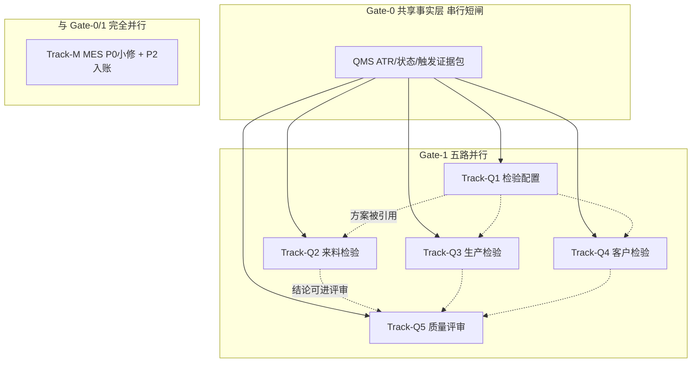

# MES + QMS 未完成文档并行收尾执行计划

> **For agentic workers:** 推荐用多 Agent 并行（`dispatching-parallel-agents` / 多会话）按本计划 Track 执行；每 Track 结束独立 `mkdocs build` 子集检查 + 聚焦 `docs:` 提交。  
> 基线：测试环境 / `dev` / 2026-07-15。  
> 制定日期：2026-07-17。  
> 节奏约定：加大单轮交付、少打断确认；未证实写入证据/总账后继续。

**Goal:** 在 BATCH-03 内并行完成 MES 残余收口与 QMS 全部分组第二轮业务化（主文档 + 维护与查询参考 + 字段证据 + 导航），使 MES/QMS 主文档达到可培训可用状态。

**Architecture:** QMS 先做一次共享事实层（申请—任务—记录、状态/判定、触发回写）再五路并行回填；MES 主文档已齐套，并行做 P2 收口（链接修正、待确认入账、跨模块边界抽样）。正式页只写业务，技术证据下沉 `project-docs/04-资料与证据/`。

**Tech Stack / 仓库约定:** MkDocs + Material；样板文风见 WMS 采购收货 / MES 计划管理；校验：`git diff --check` + `mkdocs build`；不提交 `temp/`、`sourcecode/`、登录态。

## Global Constraints

1. 正式 `docs/` 禁止 DDL/DO/DTO/VO/源码路径；技术名只进证据页。
2. 禁止把旧稿虚构 ER/英文字段/未核验状态当培训事实；QMS 旧稿一律按源码重写。
3. 申请—任务—记录引用[公共模型](../../docs/02-业务模型/01-申请任务记录模型.md)，页内只写质量差异。
4. 库存放行/隔离/退货事务以 WMS 为准；QMS 写结论与触发边界，不杜撰库存规则。
5. 生产检验与 MES 工单/报工的关联键未证实时登记总账，不阻塞其它分组。
6. 每完成一 Track（或一波并行合并）自动本地提交；推送需用户授权。
7. 既有 EAM/ANDON/SCP/PS 链接告警不记为本轮失败。

---

## 0. 现状盘点（计划起点）

### 0.1 MES

| 项 | 状态 | 未完成性质 |
| --- | --- | --- |
| 六组主文档 + 维护参考 + 证据 | **已齐套**（工艺/计划/基础建模/终端/追溯/报表） | — |
| 截图占位 | 各组仍有【截图占位】 | P2，不阻塞主文档 |
| 字典/待确认 | 路线状态、生产订单 status、待点检强制、退料闭环、离线能力、多菜单报工入口等 | P2，入总账或证据「待确认」 |
| 跨模块抽样 | MES↔WMS 发料/完工入库、MES↔QMS NG 映射 | P2 抽样 |
| 文案漂移 | 如工艺维护参考仍写「计划待第二轮重写」 | **P0 小修**，可并行立刻做 |

### 0.2 QMS（主缺口）

| 分组 | 现文档 | 缺什么 |
| --- | --- | --- |
| `index.md` | 半技术概述 | 第二轮学习顺序/边界/齐套状态 |
| 01-检验配置 | 旧稿字段表+虚构 ER | 全量业务化 + 维护参考 + 证据 + mkdocs |
| 02-来料检验 | 旧稿流程/ER | 同上；强调 vs WMS 收货 |
| 03-生产检验 | 旧稿 | 同上；首/末/巡/其他 + vs MES |
| 04-客户检验 | 旧稿 | 同上；退回检验 + vs 销售/SCP |
| 05-质量评审 | 旧稿 | 同上；评审 ATR + Q1/Q2/Q3 通知单边界 |
| 字段证据目录 | 无或极少 | `project-docs/04-资料与证据/字段证据/QMS/` |

菜单已证实存在：来料/客户退回/首件/末件/巡检/其他 的申请·任务·记录；检验方法/模板/方案/计数器；检验评审申请·任务·记录；q1/q2/q3 通知单。

---

## 1. 交付物定义（Definition of Done）

### 1.1 单个 QMS 业务分组 DoD

- [ ] `docs/07-QMS-质量管理/<NN-分组>/index.md` 按 MES/WMS 样板重写（目的、准备、对象、流程、边界、限制）
- [ ] 同目录 `*-维护与查询参考.md`（菜单、动作、联查、验收清单）
- [ ] `project-docs/04-资料与证据/字段证据/QMS/<分组>.md`
- [ ] `mkdocs.yml` 挂上维护参考
- [ ] 正文无源码路径/表名；未证实进证据或总账
- [ ] 本 Track 相关文件 `git diff --check` 干净；全站 `mkdocs build` 通过

### 1.2 MES 收口 DoD

- [ ] 过期交叉引用修正（工艺↔计划等）
- [ ] 各组「待确认」收敛到总账编号或证据页，正式页只保留短列表
- [ ] （可选同轮）截图任务清单落到 `project-docs`，不阻塞齐套声明
- [ ] 交接与 BATCH-03 清单更新为「MES 主文档齐套 + P2 进行中/已入账」

### 1.3 模块齐套声明条件

| 模块 | 可宣布「主文档齐套」当… |
| --- | --- |
| MES | 已满足；P2 不阻挡 |
| QMS | 概述 + 5 分组均达 §1.1；共享事实层证据已建 |

---

## 2. 并行 Track 设计



说明：T2/T3/T4 **不必等 T1 写完正文**——共享事实层已含「方案/模板如何被申请引用」即可开写；T1 与执行组并行。T5 可与 T2–T4 并行起草，合并前核对处置动作口径一致。

---

## 3. Track 任务清单

### Track-G0：QMS 共享事实层（串行，约 0.5–1 人时）

**产出：** `project-docs/04-资料与证据/字段证据/QMS/检验执行事实层总览.md`（可另附状态枚举摘录）

**步骤：**

1. 从 `win-module-qms`（或实际模块名）提取：检验申请/任务/记录主 DO、评审 DO、关键 Status/Result 枚举、与 WMS/MES 触发服务名。
2. 用菜单 CSV 固化六类业务的申请·任务·记录路径表。
3. 写清：**配置对象清单**（抽样/AQL/方法/特性/阶段/方案/模板/物料配置/动态规则/计数器）与 **执行对象** 的引用关系（业务语言）。
4. 列出「触发与回写」已证实 / 未证实矩阵（来料↔采购收货、生产↔工单、客户↔退货、评审↔库存）。
5. 提交：`docs: 建立QMS检验执行事实层证据`（仅 project-docs 亦可）。

**并行提示：** Track-M 可与 G0 同时开工。

---

### Track-Q1：检验配置

**文件：**

- 重写 `docs/07-QMS-质量管理/01-检验配置/index.md`
- 新增 `docs/07-QMS-质量管理/01-检验配置/检验配置-维护与查询参考.md`
- 新增 `project-docs/04-资料与证据/字段证据/QMS/检验配置.md`
- 改 `mkdocs.yml`、必要时轻改 `07-QMS-质量管理/index.md` 中该行状态

**取证焦点：** 抽样方案、AQL、样本字码、检验方法、检验特性、检验阶段、方案、模板、物料检验配置、动态规则、计数器；导入导出若存在则写维护参考。

**依赖：** G0（配置对象名单）。

**提交建议：** `docs: 完成QMS检验配置第二轮业务化`

---

### Track-Q2：来料检验

**文件：** `02-来料检验/index.md` + `来料检验-维护与查询参考.md` + `字段证据/QMS/来料检验.md` + mkdocs

**取证焦点：** 申请/任务/记录菜单与动作；与 WMS 采购收货触发；合格/不合格/让步/退货/隔离的**结论边界**（库存动作指向 WMS，不编造）。

**依赖：** G0；与 Q1 弱依赖（引用「按方案检验」）。

**提交建议：** `docs: 完成QMS来料检验第二轮业务化`

---

### Track-Q3：生产检验

**文件：** `03-生产检验/` 主文档+维护参考+证据+mkdocs

**取证焦点：** 首件/末件/巡检/其他 四套 ATR；与 MES 工单/报工/工序触发（证实则写，否则登记）；与工艺节点检验线索的边界。

**依赖：** G0；可与 Q2/Q4 并行。

**提交建议：** `docs: 完成QMS生产检验第二轮业务化`

---

### Track-Q4：客户检验

**文件：** `04-客户检验/` 全套

**取证焦点：** 客户退回检验 ATR；与销售出库/客户退货/SCP 边界；勿写成「出货 OQC」除非菜单/源码证实。

**依赖：** G0；与 Q2 并行。

**提交建议：** `docs: 完成QMS客户检验第二轮业务化`

---

### Track-Q5：质量评审

**文件：** `05-质量评审/` 全套

**取证焦点：** 检验评审申请·任务·记录；Q1/Q2/Q3 通知单是否在用、与评审关系；处置结论如何影响后续业务（指向 WMS/ANDON/MES，不写未证事务）。

**依赖：** G0；建议与 Q2–Q4 并行起草，合并前对齐「不合格出口」。

**提交建议：** `docs: 完成QMS质量评审第二轮业务化`

---

### Track-Q-INDEX：QMS 概述收束（Gate-1 之后短串行）

**文件：** `docs/07-QMS-质量管理/index.md`

**步骤：** 学习顺序、分组齐套表、核心流程图、vs WMS/MES/SCP/ANDON 边界；宣布 QMS 主文档齐套。

**提交：** 可与最后一轨合并，或单独 `docs: 收束QMS概述并宣布主文档齐套`

---

### Track-M：MES 并行收口（与 G0/Q 全程并行）

| 子任务 | 内容 | 优先级 |
| --- | --- | --- |
| M1 | 修正过期互链（如工艺维护参考「计划待重写」） | P0 |
| M2 | 汇总六组「待确认」→ `问题与待确认总账` 编号或 MES 证据待确认节 | P1 |
| M3 | 建立 `project-docs/.../MES/P2截图与环境核对任务清单.md`（占位清单化，不强制本轮拍图） | P2 |
| M4 | 抽样写清 1 页内链：终端 NG→QMS、完工→WMS（仅已证实） | P2 |
| M5 | 更新交接：MES 齐套 / QMS 并行进度 | 每波 |

**提交建议：** `docs: 收口MES交叉引用与待确认入账`（可多次小提交）

---

## 4. 推荐并行排程（人/Agent）

| 波次 | 并行单元 | 预计产出 |
| --- | --- | --- |
| **波次 A** | G0 + M1/M2 | 事实层证据 + MES 小修入账 |
| **波次 B** | Q1 ∥ Q2 ∥ Q3 ∥ Q4（四 Agent） | 四组业务化正文+维护参考+证据 |
| **波次 C** | Q5 ∥（Q1–Q4 冲突修订）∥ M3/M4 | 评审组 + 对齐不合格出口 + MES P2 清单 |
| **波次 D** | Q-INDEX + BATCH-03/交接/总任务清单更新 + 全量 `mkdocs build` | **QMS 齐套宣布** |

单 Agent 串行时：A → B 按 Q1→Q2→Q3→Q4→Q5 → D，但 **B 内仍应按「先写完一页再开下一页」避免半成品交叉污染**；有多 Agent 时严格按上表并行。

---

## 5. 多 Agent 分工模板（复制即用）

每个 QMS Agent Prompt 必含：

1. 阅读：本计划 + G0 事实层 + 样板页（`docs/05-WMS-库房管理/03-采购收货/index.md` 或 `docs/06-MES-生产管理/03-计划管理/index.md`）。
2. 只改本 Track 文件 + 必要的 `mkdocs.yml` 片段；不改其它 Track 正文。
3. 取证目录：`sourcecode/backend/**/qms**`、`reference/menu.csv`。
4. 输出：主文档、维护参考、证据三件套；未证实列表。
5. 结束：`git diff --check`；不要 `git push`；提交需符合仓库 `docs:` 中文摘要约定（若环境允许多 Agent 提交则每 Track 一提，否则由汇总 Agent 分提交）。

冲突规则：`mkdocs.yml` / `07-QMS/index.md` / 交接文件 → **仅汇总 Agent（波次 D 或指定 Owner）修改**；并行 Track 用分支或延后挂导航。

---

## 6. 风险与不停工

| ID | 风险 | 不停工策略 |
| --- | --- | --- |
| R1 | 检验状态机枚举分散 | 正式页用中文业务态；code 进证据 |
| R2 | WMS 回写未证实 | 写「结论在 QMS，库存动作见 WMS」+ GAP |
| R3 | 生产检验触发点不清 | 写菜单能力与手工申请；自动触发标待确认 |
| R4 | Q1–Q5 并行文风不一致 | 强制同一样板章节序 |
| R5 | mkdocs.yml 合并冲突 | 导航挂载集中到波次 D |
| R6 | 旧稿字段名回流 | 证据页设「否定旧稿」节 |

---

## 7. 检查清单（波次 D 关门）

- [x] MES 过期互链已修；待确认已入账（Track-M：`MES-BASE`～`MES-TERM`、`GAP-071`；P2 清单已建）
- [ ] QMS 5 组均有维护参考且在 `mkdocs.yml`
- [ ] `字段证据/QMS/` 含：事实层总览 + 5 分组证据
- [ ] QMS `index.md` 宣布齐套并给学习顺序
- [ ] `mkdocs build` 通过
- [ ] BATCH-03 占位清单、总任务清单、交接已更新
- [ ] 本地提交完成；推送等待授权

---

## 8. 立即执行命令（Owner）

```text
1. 建/更新本计划（本文件）并提交计划本身
2. 启动波次 A：G0 + Track-M（可两 Agent）
3. G0 合并后启动波次 B 四并行
4. 波次 C → D 关门宣布 QMS 齐套
```

**完成判据一句话：** MES 无 P0 文档债；QMS 五分组+概述均达第二轮样板且证据齐全；全站构建通过。
